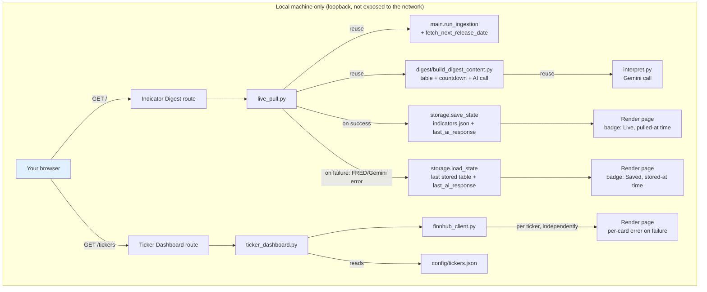

# V1.1 Technical Design — Web Dashboard

**Companion to:** investment_dashboard_requirements.md, v1.1_user_stories.md, v1_technical_design.md
**Adds to the v1 stack:** Flask (local web server) · Finnhub API (ticker price/news data)
**Hosting:** local-only — `localhost`, bound to loopback only, started on demand (Section 4.1 of the requirements doc)

**Product shape:** v1.1 adds two web pages served by one local Flask app: the **Indicator Digest Page** (a browsable, live-refreshing version of the v1 digest email) and the **Ticker Dashboard** (new content, not previously in any email). Both reuse v1's existing modules rather than duplicating logic — see Section 3.

---

## 1. Architecture Overview



**Why this shape:** the Indicator Digest Page doesn't get its own data pipeline — it drives the *same* ingestion and interpretation code the v1 email already uses, so the two surfaces can never disagree about what "current" means. The Ticker Dashboard is genuinely new (Finnhub, not FRED) but follows the same pattern: a thin route handler, a data-assembly module, per-item error isolation.

## 2. Repository Structure (additions to v1)

```
/
├── config/
│   └── tickers.json              # NEW — ticker watchlist (Section 7 of requirements doc)
├── src/
│   ├── web/                      # NEW
│   │   ├── app.py                 # Flask app: route registration, loopback-only binding
│   │   ├── live_pull.py           # Indicator Digest Page: orchestrates live pull + fallback (Story 1a)
│   │   ├── page_template.py       # HTML rendering for both pages (plain string-building, matching
│   │   │                          #   mailer/email_template.py's convention — no new templating dependency)
│   │   ├── ticker_dashboard.py    # Ticker Dashboard: assembles per-ticker card data (Story 3)
│   │   └── finnhub_client.py      # Finnhub API wrapper: quote, candles, company news
│   ├── digest/
│   │   ├── build_digest_content.py  # NEW — extracted from post_release.py: builds {table, countdown,
│   │   │                            #   ai_result} from state. Both post_release.py (weekly-throttled
│   │   │                            #   email) and live_pull.py (every page load) call this, so the
│   │   │                            #   table/countdown/AI-assembly logic exists in exactly one place
│   │   ├── post_release.py        # (existing) — now calls build_digest_content() instead of building
│   │   │                          #   the table/countdown inline; throttle + email-send logic unchanged
│   │   ├── interpret.py           # (existing) — unchanged call signature; caller now persists the result
│   │   └── heuristics.py          # (existing, unchanged)
├── static/                        # NEW — served by Flask (plain CSS, no framework)
│   └── dashboard.css
└── run_web.sh                     # NEW — convenience script: activates venv, starts Flask on 127.0.0.1
```

No changes to `.github/workflows/indicator-check.yml` or the existing `fred/`, `storage/`, `mailer/` modules beyond what's noted above.

## 3. Data Schema Changes

### 3.1 `data/indicators.json` — new `last_ai_response` field

v1 generated the AI summary fresh for each email and never persisted it (confirmed in v1 technical design: "Deliberately excluded from the input: the AI's own past interpretations" — meaning not fed back into the prompt, but as a side effect it also was never saved anywhere). The Indicator Digest Page's fallback path (Story 1a) needs a persisted copy to show when a live pull fails, so v1.1 adds:

```json
{
  "last_digest_sent_at": "2026-09-04T14:00:00+00:00",
  "last_ai_response": {
    "summary": "Jobless claims ticked up while CPI cooled, suggesting...",
    "directional_read": "neutral",
    "generated_at": "2026-09-12T18:03:11+00:00"
  },
  "indicators": { "...": "unchanged from v1" }
}
```

- `last_ai_response` is overwritten (not appended) on every successful Gemini call — both from the weekly email (`post_release.py`) and from a page-triggered live pull (`live_pull.py`). Both call sites go through `build_digest_content()`, which is where the persistence happens, so this is one code path, not two.
- If a live pull's Gemini call fails but the FRED fetch succeeds, `last_ai_response` is left untouched (still holds the last successful one) and the page falls back to it, labeled with its own `generated_at` — independent of whether the indicator *values* shown are freshly live or also fallback.

### 3.2 `config/tickers.json` — new file (per Section 7 of the requirements doc)

```json
{
  "groups": {
    "stocks": ["SPY", "IVW", "DGRO"],
    "bonds": ["VGIT", "VGLT"],
    "international": ["VIGI", "VYMI", "EMB"],
    "sector": ["FTEC"],
    "individual": ["MSFT", "RELY"]
  }
}
```

`groups` is read as an open map — `ticker_dashboard.py` iterates whatever keys are present, in file order, rather than looking up a fixed set of expected group names. This is a deliberate constraint on the implementation: **no group name may ever be hardcoded** in `ticker_dashboard.py` or `page_template.py`; both must derive the page's section headers directly from this file's keys. That's what makes "add/rename/remove a group" a config-only edit (Story 2's AC) rather than a code change.

Loaded fresh on every request to `/tickers` (it's a small hand-edited file — no need to cache or watch it), so an edit takes effect on the next page reload with no restart required.

## 4. Indicator Digest Page — Live Pull & Fallback Design (Story 1, 1a)

`live_pull.py`, called from the `/` route:

1. `state = storage.load_state()` — the current committed `data/indicators.json`.
2. Attempt the live path: `main.run_ingestion(state)` (re-fetches all 8 FRED series, appends any genuinely new values, same dedup-by-date logic as v1) followed by `build_digest_content(state)` (table + countdown + a fresh Gemini call).
3. **On full success:** `storage.save_state(state)` (persists any new indicator values and the new `last_ai_response`), then render with a **Live** badge showing the pull's timestamp (`now()`, captured right before step 2).
4. **On failure** (a FRED request error, or — since ingestion is per-indicator try/except, same as v1 — a partial fetch failure that leaves the content builder without enough fresh data to be meaningfully "live"; also triggered if the whole live attempt raises, e.g. a network error before any per-indicator handling runs): re-`load_state()` fresh (discarding any partial in-memory mutation from the failed attempt) and render `build_digest_content(state)` — table + countdown from stored `history`, AI section from stored `last_ai_response` — with a **Saved** badge showing `last_ai_response["generated_at"]` (or, if that's also absent — e.g. a brand-new install before any digest has ever run — the store's most recent indicator `fetched_at` instead, with a note that no AI read is on file yet).
5. A per-indicator FRED failure within step 2 does **not** by itself force the whole page into fallback — this mirrors v1's ingestion (Story 1: one bad fetch logs and continues). The page only falls back when the live attempt can't produce a usable "this is current" result at all (e.g. every indicator's fetch failed, or the Gemini call raised after retries **and** step 2 otherwise succeeded — in that narrower case the *table* can still be shown live while the AI section falls back to the stored `last_ai_response`, each carrying its own Live/Saved label rather than forcing the whole page to one status). This mirrors v1's per-section graceful degradation (Story 4's AC): the AI section and the table/countdown are allowed independent freshness states.
6. **Known trade-off (flagged in the requirements doc, Section 8):** step 3's `save_state()` writes to the same `data/indicators.json` the GitHub Actions workflow commits. A local live pull will leave that file locally modified (`git status` will show it dirty) until you either commit it yourself or reset it. Because ingestion is idempotent (dedup by date, Section 3 of the v1 design), this never corrupts history or double-counts a value — the risk is purely a local working-tree diff, not a data-integrity issue. No git commit/push is triggered automatically by the web app.

## 5. Ticker Dashboard — Finnhub Integration Design (Story 2, 3)

### 5.1 `finnhub_client.py`
Thin wrapper around three Finnhub REST endpoints, each independently callable so one ticker's failure can't affect another's:
- **Quote** (`/quote`) — current price
- **Candles** (`/stock/candle`, daily resolution, ~1 year back) — source data for the 52-week high/low and the 20-day/200-day simple moving averages (Finnhub doesn't return moving averages directly; they're computed client-side from the candle closes)
- **Company news** (`/company-news`, date-bounded to the last ~7 days) — recent related headlines

### 5.2 `ticker_dashboard.py`
For each ticker in `config/tickers.json`, independently:
1. Fetch quote + candles + news.
2. Compute 52-week high/low and the two moving averages from the candle series.
3. On any failure for that ticker (API error, rate limit, unrecognized/delisted symbol), catch it locally and mark that ticker's card as errored — the loop continues to the next ticker (same per-item isolation pattern as v1's `run_ingestion`, Story 2's AC).
4. Assemble one card dict per ticker: `{symbol, group, price, week52_low, week52_high, ma20, ma200, news: [...], error: str | None}`.

Cards are grouped for rendering using the same `groups` structure from `config/tickers.json`, in file order — each group's display header is derived from its config key (e.g. title-cased: `sector` → "Sector"), not looked up from a fixed list, so a new or renamed group key appears correctly with zero code changes (Section 3.2). An unrecognized/invalid symbol in the config (Story 2's AC) is skipped with a logged warning before it ever reaches the Finnhub client.

### 5.3 Freshness
No live/saved fallback design here — unlike the Indicator Digest Page, there's no persisted "last known ticker snapshot" in v1.1 (that's a bigger addition than the requirements asked for). A ticker whose fetch fails simply shows an error state on that card (Story 3's AC); reloading re-fetches everything, same as today's Fidelity website behavior.

## 6. Local Hosting & Access

- `app.py` binds explicitly to `127.0.0.1` (loopback only) — never `0.0.0.0` — so the app is unreachable from anything but the machine it's running on, regardless of what's on the local network.
- No authentication layer: unnecessary when the app is never reachable outside the machine itself.
- Started manually when you want to check it (`./run_web.sh` or `flask --app src/web/app run`), not run continuously as a background service — matches the requirements doc's local-only decision (Section 4.1) and its accepted trade-off (only reachable while you've started it).
- `FINNHUB_API_KEY` is read via `os.environ.get`, same convention as every other secret in this codebase (`fetch_fred.py`, `send_email.py`) — add it to your local `.env` alongside the existing keys; no new secret-loading mechanism is introduced.

## 7. Secrets & Configuration (v1.1 additions)

| Secret | Purpose | Where used |
|---|---|---|
| `FINNHUB_API_KEY` | Authenticates Finnhub API requests | `finnhub_client.py` (local `.env` only — not a GitHub Actions secret, since the ticker dashboard doesn't run in the scheduled workflow) |

All v1 secrets (`FRED_API_KEY`, `GEMINI_API_KEY`, etc.) are reused as-is by the live-pull path, read from the same local `.env`.

## 8. Error Handling & Idempotency Summary (v1.1 additions)

- Live pull failure (Section 4) falls back to stored data + stored AI response, never an error page — the table/countdown and the AI section can independently be Live or Saved
- `save_state()` after a successful live pull reuses v1's existing dedup-by-date logic — safe to call from a second, independent trigger path (page load) in addition to the scheduled workflow, with no duplicate-entry risk
- Per-ticker try/catch in `ticker_dashboard.py` — one bad Finnhub call logs and shows an error card, doesn't block the other tickers (Story 2/3 AC)
- An unrecognized ticker symbol in `config/tickers.json` is skipped with a logged warning before hitting the Finnhub client
- Local Flask app errors (e.g. a totally malformed `config/tickers.json`) render a plain error page rather than a stack trace — this is a local single-user tool, not a hardened public service, so this is a minimal safeguard rather than full input-validation hardening

## 9. Open Questions / Risks Carried Into Build

(See also Section 8 of the requirements doc, which these mirror at the implementation level.)
- Per-visit Gemini/FRED calls (every Indicator Digest Page load, not just the 6-hourly scheduled check) — confirm this stays within free-tier rate limits under realistic single-user usage before relying on it daily
- Local `data/indicators.json` working-tree diffs after a live pull (Section 4.6 above) — no automated reconciliation is planned for v1.1; worth revisiting if it becomes annoying in practice
- Finnhub free-tier candle history depth should be confirmed to comfortably cover a 200-day moving average (needs ~200+ trading days of daily closes, i.e. close to a year of data)

## 10. One-Time Setup Checklist (v1.1, in addition to v1's)
- [ ] Add `flask` to `requirements.txt`, install
- [ ] Create a free Finnhub API key, add `FINNHUB_API_KEY` to local `.env`
- [ ] Create `config/tickers.json` from the draft format (Section 7 of the requirements doc)
- [ ] Extract `build_digest_content()` out of `post_release.py`; update `post_release.py` to call it rather than building the table/countdown inline
- [ ] Add `last_ai_response` handling to wherever `interpret.py`'s result is currently consumed, so both the email path and the live-pull path persist it the same way
- [ ] Verify `app.run(host="127.0.0.1", ...)` — confirm the app is unreachable from another device on the same network before considering this done
