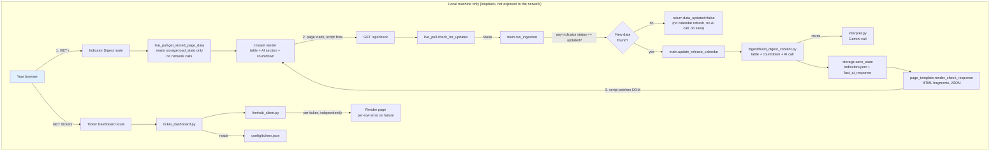
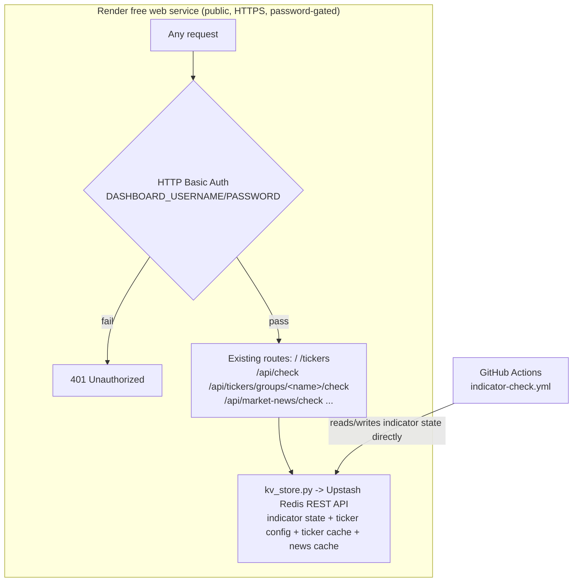

# V2 Technical Design — Web Dashboard

**Companion to:** investment_dashboard_requirements.md, v2_user_stories.md, v1_technical_design.md
**Adds to the v1 stack:** Flask (local web server) · Finnhub API (ticker price/52-week range) · Yahoo Finance's public chart endpoint (moving averages)
**Hosting:** local-only — `localhost`, bound to loopback only, started on demand

**Product shape:** v2 adds two web pages served by one local Flask app: the **Indicator Digest Page** (a browsable, live-refreshing version of the v1 digest email) and the **Ticker Dashboard** (new content). Both reuse v1's existing modules rather than duplicating logic — see Section 3.

---

## 1. Architecture Overview



**Why this shape:** the Indicator Digest Page drives the *same* ingestion and interpretation code the v1 email already uses, so the two surfaces can never disagree about "current." It's split into a fast synchronous path (`/`, stored data only) and a background path (`/api/check`, the actual live pull) so the reader never waits on FRED or Gemini, and a check that finds nothing new costs a FRED call but never a Gemini call. The Ticker Dashboard is genuinely new (Finnhub, not FRED) but follows the same pattern: a thin route handler, a data-assembly module, per-item error isolation.

## 2. Repository Structure (additions to v1)

```
/
├── config/
│   └── tickers.json              # ticker watchlist (Section 7 of requirements doc)
├── data/
│   ├── tickers.json               # gitignored snapshot cache — not the config file above
│   └── market_news.json          # gitignored market-news cache
├── src/
│   ├── web/
│   │   ├── app.py                 # Flask app: GET / and GET /tickers (fast renders), GET /api/check
│   │   │                          #   (background live pull) and, per ticker group, GET
│   │   │                          #   /api/tickers/groups/<name>/check plus GET /api/market-news/check
│   │   ├── live_pull.py           # Indicator Digest Page: stored-only render + gated background check
│   │   ├── page_template.py       # HTML rendering for both pages (plain string-building, matching
│   │   │                          #   mailer/email_template.py's convention)
│   │   ├── ticker_dashboard.py    # config loading, per-ticker card assembly, stored-render/live-check split
│   │   ├── finnhub_client.py      # Finnhub API wrapper: quote, 52-week range (NOT candles — see 5.1)
│   │   └── yahoo_client.py        # Yahoo Finance chart-endpoint wrapper: daily closes for moving averages
│   ├── digest/
│   │   ├── build_digest_content.py  # builds {table, countdown, ai_result} from state — called by both
│   │   │                            #   post_release.py (weekly-throttled email) and live_pull.py (every
│   │   │                            #   page load), so table/countdown/AI-assembly logic lives in one place
│   │   ├── post_release.py        # calls build_digest_content(); throttle + email-send logic unchanged
│   │   ├── interpret.py           # (existing) — caller now persists the result
│   │   └── heuristics.py          # (existing, unchanged)
├── static/
│   └── dashboard.css              # served by Flask, plain CSS, no framework
└── run_web.sh                     # convenience script: activates venv, starts Flask on 127.0.0.1
```

No changes to `.github/workflows/indicator-check.yml` or the existing `fred/`, `storage/`, `mailer/` modules beyond what's noted above.

## 3. Data Schema Changes

### 3.1 `data/indicators.json` — `last_ai_response` field

v1 generated the AI summary fresh for each email and never persisted it. The Indicator Digest Page's fallback path needs a persisted copy to show when a live pull fails:

```json
{
  "last_digest_sent_at": "2026-09-04T14:00:00+00:00",
  "last_ai_response": {
    "summary": "Jobless claims ticked up while CPI cooled, suggesting...",
    "directional_read": "neutral",
    "generated_at": "2026-09-12T18:03:11+00:00"
  },
  "indicators": { "...": "unchanged from v1" }
}
```

- `last_ai_response` is overwritten (not appended) on every successful Gemini call — both from the weekly email (`post_release.py`) and from a page-triggered live pull (`live_pull.py`). Both call sites go through `build_digest_content()`, so this is one code path.
- If a live pull's Gemini call fails but the FRED fetch succeeds, `last_ai_response` is left untouched and the page falls back to it, labeled with its own `generated_at`.

### 3.2 `config/tickers.json`

```json
{
  "groups": {
    "stocks": ["SPY", "IVW", "DGRO"],
    "bonds": ["VGIT", "VGLT"],
    "international": ["VIGI", "VYMI", "EMB"],
    "sector": ["FTEC"],
    "individual": ["MSFT", "RELY"]
  }
}
```

`groups` is read as an open map — `ticker_dashboard.py` iterates whatever keys are present, in file order, rather than a fixed set of expected group names. **No group name may ever be hardcoded** in `ticker_dashboard.py` or `page_template.py`; both derive section headers directly from this file's keys.

Loaded fresh on every request to `/tickers` — an edit takes effect on the next page reload with no restart required.

## 4. Indicator Digest Page — Fast Render + Background Check Design

### 4.1 `GET /` — instant, stored-only render
`live_pull.get_initial_page_data()` builds the page entirely from `storage.load_state()` — `build_indicators_context`/`build_table`/`build_countdown` (all pure, no network) plus whatever `last_ai_response` is on file (or a placeholder, on a brand-new install). No FRED or Gemini call happens on this request. Each table row also renders a small inline-SVG trend sparkline (`page_template._render_sparkline_svg`).

### 4.2 `GET /api/check` — the actual live pull, called by the page's own script
`live_pull.check_for_updates()`:
1. `main.run_ingestion(state)` — re-fetches all 8 FRED series, same dedup-by-date logic as v1.
2. **Gate:** if no indicator's result has `status == "updated"`, return `{"data_updated": False}` immediately — no calendar refresh, no `build_digest_content` call, no `save_state`.
3. Only when at least one indicator *did* get a new value: `main.update_release_calendar(state)`, then `build_digest_content(state, updated_keys)` (table + countdown + a fresh Gemini call), then `storage.save_state(state)`. Returns `{"data_updated": True, "content": {...}, "checked_at": now}`.
4. Unexpected errors are caught and also reported as `{"data_updated": False}`.

`app.py`'s `/api/check` route converts a `data_updated: True` result into HTML fragments via `page_template.render_check_response` (reusing the same private `_render_table_section`/`_render_countdown_section`/`_render_ai_section` helpers the initial page uses) and returns them as JSON.

### 4.3 Client-side patching
The rendered page shows a `#checking-indicator` ("Checking for updates...") next to the header on load. The inline script removes it once `/api/check` settles, then — only if `data_updated` is true — replaces `#table-section` and `#countdown-section`'s `innerHTML`, and — only if `ai_html` is also non-null — replaces `#ai-section`'s `innerHTML` too. If FRED found new data but Gemini failed, the table/countdown update while the AI section is left as-is.

### 4.4 Known trade-off
`check_for_updates`'s `save_state()` call writes to the same `data/indicators.json` the GitHub Actions workflow commits. A local check that finds new data leaves that file locally modified until committed or discarded. Ingestion is idempotent (dedup by date), so this never corrupts history — the risk is purely a local working-tree diff. A check that finds nothing new never calls `save_state` at all.

## 5. Ticker Dashboard — Finnhub + Yahoo Integration Design

Finnhub's free tier returns 403 for `/stock/candle` regardless of symbol, resolution, or asset class. 52-week range instead comes from a different free Finnhub endpoint; moving averages get their daily closes from Yahoo Finance's public chart endpoint. (stooq.io was evaluated and rejected — its requests go through a client-side proof-of-work bot challenge.)

### 5.1 `finnhub_client.py`
Thin wrapper around two Finnhub REST endpoints, each independently callable so one ticker's failure can't affect another's:
- **Quote** (`/quote`) — current price, plus `d`/`dp` (change since last close)
- **52-week range** (`/stock/metric?metric=all`) — Finnhub precomputes `52WeekHigh`/`52WeekLow`, still free
- **General news** (`/news?category=general`) — filtered client-side to Finnhub's own `"top news"` tag

### 5.1a `yahoo_client.py`
Thin wrapper around Yahoo Finance's public, unauthenticated chart endpoint (`query1.finance.yahoo.com/v8/finance/chart/{symbol}`), used only for a year of daily closes to compute the 20/50/200-day simple moving averages. Implemented as a direct `requests` call rather than the `yfinance` library, to avoid its heavier dependency tree.

### 5.2 `ticker_dashboard.py`
For each ticker in `config/tickers.json`, independently:
1. Fetch quote + 52-week range/market cap/P/E (`finnhub_client.fetch_stock_metrics`, one `/stock/metric` call) from Finnhub and daily closes from Yahoo.
2. Compute the three moving averages (`MA_WINDOWS = (20, 50, 200)`) from the Yahoo close series.
3. On any failure for that ticker, catch it locally and mark that ticker's row as errored — the loop continues (same per-item isolation pattern as v1's `run_ingestion`). The row fails as a whole rather than partially.
4. Compute `pct_off_high = (week52_high - price) / week52_high * 100` (no new fetch).
5. Assemble one card dict per ticker: `{symbol, group, price, change, change_percent, week52_low, week52_high, pct_off_high, market_cap, pe_ratio, ma20, ma50, ma200, error: str | None}`. `market_cap`/`pe_ratio` can independently be `None` on an otherwise-successful card — Finnhub doesn't populate them for every symbol.

Cards are grouped for rendering using the `groups` structure from `config/tickers.json`, in file order — each group's display header is derived from its config key (e.g. `sector` → "Sector"). An unrecognized/invalid symbol is skipped with a logged warning before it reaches either client.

Fetches run concurrently via `ThreadPoolExecutor` (`max_workers=5` — deliberately modest, since maxing out Finnhub's free-tier rate limit risks trading slow-but-successful fetches for fast 429s). `main.run_ingestion()`/`update_release_calendar()` use the same pattern, one thread per indicator. Only the fetch calls run concurrently; state mutation and result-building run single-threaded afterward, and `executor.map`'s output-order guarantee keeps results grouped/ordered exactly as a sequential version would.

### 5.2a Rendering: one table per group
Columns: Ticker, Price, Change, 52-Week Range, % Off High, Market Cap, P/E, 20d/50d/200d MA, then a trailing unlabeled remove-button column (Section 5.2c). Two encodings follow the "status" pattern (a small fixed good→warning→critical scale, never color-alone):
- **52-week range** — an SVG gradient bar (green at the low end → amber at the midpoint → red at the high end) with a marker circle at the current price's position within `[low, high]`. Low/high are also printed as plain text below the bar.
- **Each moving average** — the value plus a signed `▲`/`▼` and percentage showing how far price sits above/below that average, colored green (above)/red (below).
- `pct_off_high` renders as a plain, uncolored number (the range bar already carries the status signal).
- `change`/`change_percent` render with the same signed `▲`/`▼` + color convention as the moving-average cells, plus the absolute $ change.
- `market_cap` (`page_template._format_market_cap`) renders as `$` plus the largest T/B/M suffix that keeps it readable (Finnhub's `marketCapitalization` comes back in millions of USD); `pe_ratio` renders as a plain one-decimal number. Either renders "n/a" when Finnhub has no value for that symbol — not an error, since it's common for micro-caps, non-US listings, or companies with no trailing earnings.
- A ticker with `ma20`/`ma50`/`ma200` as `None` (fewer closes than that window, e.g. a recent IPO) renders "n/a" in that cell.
- An errored ticker renders as a single row with `colspan` across the data columns (`_TICKER_DATA_COLUMN_COUNT`) and "Unable to load data.", followed by its own remove-button cell — removal doesn't depend on a successful fetch.

### 5.2b Sortable columns
Each `<tr>` (`page_template._render_ticker_row`) carries `data-symbol`/`data-pct-off-high` attributes (the latter empty for a pending/errored card); the Ticker and % Off High `<th>`s carry `class="sortable" data-sort-key="symbol"|"pctOffHigh"`. A click handler in `render_ticker_dashboard_page`'s inline `<script>`, event-delegated on `#ticker-groups`, reorders that `<table>`'s `<tbody>` rows in the DOM — no server round trip, no re-render. Clicking toggles ascending/descending (tracked via `sort-asc`/`sort-desc` classes on the `<th>`, which also drive the CSS arrow via `::after`); rows with an empty `data-pct-off-high` always sort last regardless of direction. Sorting is per table (per group), purely client-side state, and is lost when that group's own `/api/tickers/groups/<name>/check` refresh lands (it replaces just that group's `.category-block` wholesale — other groups' sort state is untouched, per Section 11.8's per-group split).

### 5.2c In-app ticker editing
`ticker_dashboard.add_ticker_to_group`/`remove_ticker_from_group` read-modify-write `config/tickers.json` directly (or Redis, Section 11.3, when configured). Only mutate an existing group's ticker list — creating/renaming/removing a group is still a hand-edit. `POST /api/tickers/add`/`/remove` (`app.py`) wrap these; invalid input raises `TickerConfigError`, returned as a 400. The remove button renders as the row's own trailing `<td>`, not next to the ticker symbol, so it doesn't crowd the column readers scan first. Both are event-delegated on `#ticker-groups`, since that div's contents survive a child group block being swapped out.

**Remove (added 2026-09-16):** optimistic — the row is removed from the DOM immediately on confirm, before the `/api/tickers/remove` request resolves, and the page is *not* reloaded on success. A failure (network error or a 400 from `TickerConfigError`) re-inserts the row at its original position and shows an alert. This replaced an earlier `window.location.reload()`-on-success design that made every single-row removal pay the cost of a full watchlist live refresh just to reflect one row disappearing.

**Add** still reloads the page on success — constructing a correct pending-row fragment client-side (to match `page_template._render_ticker_row`'s pending-state markup) wasn't worth doing for a lower-frequency action; revisit if add starts feeling as slow as remove did.

### 5.3 Freshness
- **`data/tickers.json`** (gitignored — a cache, not the historical record `data/indicators.json` is) stores one snapshot per ticker: `{symbol: {price, change, change_percent, week52_low, week52_high, pct_off_high, market_cap, pe_ratio, ma20, ma50, ma200, fetched_at}}`.
- **`ticker_dashboard.get_initial_ticker_page_data()`** — stored-only, no network, mirrors `live_pull.get_initial_page_data()`. A ticker with no cached snapshot renders as a pending/"Loading…" row.
- **`ticker_dashboard.check_for_ticker_updates()`** — the real live pull, mirrors `live_pull.check_for_updates()`, with one difference: no "skip if nothing changed" gate — every check re-fetches every ticker live via `build_ticker_cards()` and persists every success back to the cache. A ticker whose live fetch fails resolves to its last cached snapshot silently if one exists, or the error state if not. Takes an optional `config` subset (Section 11.8) so a caller can live-check just one group.
- **`/api/tickers/groups/<name>/check`** (Section 11.8) calls `check_for_ticker_updates(config={name: symbols})` for just that one group and returns `{"group_html": ...}` (`page_template.render_ticker_group_check_response`) for the page's script to swap into that group's own `.category-block`. **`/api/market-news/check`** is the equivalent for market news, returning `{"news_html": ...}` (`render_market_news_check_response`) for `#market-news`.
- No per-ticker progressive/streaming updates — per-group granularity plus concurrent fetching within a group already deliver most of the UX gain for far less complexity.

## 5a. Cross-Page Navigation
Both `render_indicator_digest_page` and `render_ticker_dashboard_page` (`page_template.py`) render a shared `_render_nav(active_path)` — two links (`/`, `/tickers`) with the current page's link marked `.active`.

## 5b. US Stock Market News
- **`finnhub_client.fetch_market_news(limit=10)`** — `/news?category=general`, filtered to `category == "top news"` as the closest available signal to "US stock market news" (the raw feed is a broad wire, not market-specific).
- **Where it renders:** once, in a `#market-news` div at the top of `render_ticker_dashboard_page`, above `#ticker-groups`.
- **Freshness:** its own route, `/api/market-news/check` (Section 11.8), fetched independently of any ticker group's own check. Its own cache file: **`data/market_news.json`** (gitignored), shape `{"headlines": [...], "fetched_at": ...}`. `ticker_dashboard.get_initial_market_news()`/`check_for_market_news()` mirror the ticker-card split at whole-section granularity.
- **Failure handling:** a failed live fetch with no cached fallback renders "Market news unavailable." rather than breaking the ticker tables below it; with a cached fallback, it degrades silently to the last known headlines.

## 6. Local Hosting & Access

- `app.py` binds explicitly to `127.0.0.1` (loopback only) — never `0.0.0.0`.
- No authentication layer: unnecessary when the app is never reachable outside the machine itself.
- Started manually when you want to check it (`./run_web.sh` or `flask --app src/web/app run`), not run continuously as a background service.
- `FINNHUB_API_KEY` is read via `os.environ.get`, same convention as every other secret in this codebase.

## 7. Secrets & Configuration (v2 additions)

| Secret | Purpose | Where used |
|---|---|---|
| `FINNHUB_API_KEY` | Authenticates Finnhub API requests | `finnhub_client.py` (local `.env` only — not a GitHub Actions secret) |

All v1 secrets (`FRED_API_KEY`, `GEMINI_API_KEY`, etc.) are reused as-is by the live-pull path, read from the same local `.env`.

## 8. Error Handling & Idempotency Summary (v2 additions)

- Live pull failure falls back to stored data + stored AI response, never an error page — the table/countdown and the AI section can independently be Live or Saved
- `save_state()` after a successful live pull reuses v1's existing dedup-by-date logic — safe to call from a second, independent trigger path (page load) in addition to the scheduled workflow
- Per-ticker try/catch in `ticker_dashboard.py` — one bad Finnhub call logs and shows an error row, doesn't block the other tickers
- An unrecognized ticker symbol in `config/tickers.json` is skipped with a logged warning before hitting the Finnhub client
- Local Flask app errors (e.g. a malformed `config/tickers.json`) render a plain error page rather than a stack trace — a minimal safeguard for a local single-user tool, not full input-validation hardening

## 9. Open Questions / Risks

- Per-visit Gemini/FRED calls (every Indicator Digest Page load, not just the scheduled check) — confirm this stays within free-tier rate limits under realistic single-user usage
- Local `data/indicators.json` working-tree diffs after a live pull (Section 4.4) — no automated reconciliation planned; revisit if it becomes annoying in practice

## 10. One-Time Setup Checklist (in addition to v1's)
- [ ] Add `flask` to `requirements.txt`, install
- [ ] Create a free Finnhub API key, add `FINNHUB_API_KEY` to local `.env`
- [ ] Create `config/tickers.json` from the format in Section 7 of the requirements doc
- [ ] Verify `app.run(host="127.0.0.1", ...)` — confirm the app is unreachable from another device on the same network

## 11. Hosted Live Dashboard (v2.1)

**Hosting:** Render free web service, connected to the GitHub repo with auto-deploy on push to `main`. The free tier spins the container down after ~15 minutes idle; the next request pays a cold start (tens of seconds) — an accepted tradeoff, since easy setup mattered more than avoiding that delay for a single low-traffic user.

### 11.1 Architecture



Nothing about the existing route logic changes — `app.py`, `live_pull.py`, `main.py`, and `ticker_dashboard.py`'s business logic are the same whether run locally or hosted. Only two things are added in front of/underneath them: an auth gate, and a storage backend swap for every JSON blob that has no other durable home — as of Story 11 (Section 11.7), that now includes indicator state alongside the two ticker-related blobs.

### 11.2 Auth gate — implemented
- `app.py`'s `_require_auth` `before_request` hook compares the request's `Authorization: Basic` header against `DASHBOARD_USERNAME`/`DASHBOARD_PASSWORD` env vars, via `secrets.compare_digest` — hand-rolled, no new dependency, matching this project's minimal-dependency convention
- If either env var is unset (the local-dev default), the hook is a no-op — local behavior is unchanged. (Read literally, the story's AC only calls out "neither set"; treating "only one set" the same way — auth off — was a deliberate choice to avoid an accidental lockout from a typo'd env var name.)
- If both are set, every route (including `/api/check*`) requires valid credentials; a missing/incorrect header returns 401 with a `WWW-Authenticate` challenge so the browser prompts for credentials natively
- Covered by `tests/test_app.py`; verified locally including under gunicorn (Section 11.5)

### 11.3 `kv_store.py` — Upstash Redis wrapper — implemented
- Thin wrapper using `requests` against Upstash's REST API (`UPSTASH_REDIS_REST_URL` + `UPSTASH_REDIS_REST_TOKEN`, bearer-token auth) — no Redis client library needed, matching `finnhub_client.py`/`yahoo_client.py`'s plain-`requests` convention
- Two operations: `get_json(key) -> dict | None` (`GET {url}/get/{key}`, reading the `{"result": ...}` envelope Upstash returns, `None` if the key doesn't exist) and `set_json(key, value: dict)` (`POST {url}/set/{key}` with the JSON-encoded value as the raw request body) — both raise `KvStoreError` on any non-2xx response or malformed body. `is_configured()` is the single switch other modules check (true iff `UPSTASH_REDIS_REST_URL` is set).
  **Caveat:** this wire format was implemented from Upstash's documented REST API pattern, not verified against a live Upstash instance (no account was available in this session) — smoke-test `get_json`/`set_json` against a real Upstash database once one exists, before relying on it in production.
- Backend selection lives in `ticker_dashboard.py`: `_load_raw_config`/`_save_raw_config` (config), `load_ticker_state`/`save_ticker_state` (ticker cache), `load_market_news_state`/`save_market_news_state` (news cache) each check `kv_store.is_configured()`; if true, they route through `kv_store.py`, else they use the existing local-file `open()` calls unchanged — one function per operation, one branch inside it, not two parallel code paths per caller. `app.py`'s routes are untouched — they still just call these functions with default args
- Keys: `ticker_config`, `ticker_cache`, `market_news_cache`
- A ticker/news cache failure (`KvStoreError`) is caught and degrades to the same empty/pending state a missing local file would produce (logged, not raised). A ticker **config** failure is *not* caught — it propagates out of `_load_raw_config`, per Story 9's AC that a broken watchlist load should fail loudly rather than silently render empty

### 11.4 Seeding — implemented
`_load_raw_config()`, when Redis-backed and the `ticker_config` key doesn't exist yet, reads the repo's bundled `config/tickers.json` once and writes it to Redis before returning it — so a fresh deploy starts with the existing watchlist rather than an empty one. After that first write, the repo file is no longer consulted for a hosted deployment; local development is unaffected since it never touches Redis. Covered by `tests/test_ticker_dashboard.py::TestRedisBackedTickerConfig` and `tests/test_kv_store.py` (mocked Upstash responses, no real network calls per this project's testing convention).

### 11.5 Deployment mechanics
- Flask's built-in dev server (`app.run(...)`) isn't meant for production; Render's start command instead runs `gunicorn` — added to `requirements.txt`
- `app.py` binds `127.0.0.1` for local dev; Render needs `0.0.0.0` on the `$PORT` it assigns — gunicorn's `-b 0.0.0.0:$PORT` handles the bind, so `app.py`'s own `app.run(host="127.0.0.1", ...)` call stays under `if __name__ == "__main__":` and simply isn't what Render invokes
- **Confirmed:** this project has no `__init__.py`/package imports — every module does its own `sys.path.insert`, run at module level as soon as the module is imported, before any of its own route-handler imports execute. Verified locally that gunicorn (which imports `app.py` as a module rather than running it as `__main__`) hits those inserts in the right order with no shim needed — `cd src/web && gunicorn app:app -b 127.0.0.1:8000` served `/` and `/tickers` correctly. The one requirement: gunicorn's working directory must be `src/web` itself (equivalently, `--chdir src/web app:app` from the repo root), since `app:app` is a bare module-name import with no package path to it. Render's start command: `gunicorn --chdir src/web app:app -b 0.0.0.0:$PORT`
- Render env vars needed, in addition to the existing `FRED_API_KEY`/`GEMINI_API_KEY`/`FINNHUB_API_KEY`: `DASHBOARD_USERNAME`, `DASHBOARD_PASSWORD`, `UPSTASH_REDIS_REST_URL`, `UPSTASH_REDIS_REST_TOKEN`. `GMAIL_*` are not needed on Render — the digest email still only sends from the GitHub Actions workflow
- **Gotcha confirmed live (1):** adding/editing env vars in Render's dashboard does not take effect on its own — there's a separate "Save, rebuild, and deploy" (or similar) confirmation that actually restarts the service with the new environment. Skipping it leaves the running container on its *old* environment indefinitely, with no error or warning. This produced a confusing false negative for Story 9: `/api/tickers/remove` returned `{"ok": true}` (a real, successful write — just to the container's own ephemeral local file, since `kv_store.is_configured()` was still reading the old, Redis-less environment) while Upstash's `ticker_config` never changed. `kv_store.py` itself was verified correct the whole time (a standalone script round-tripping `get_json`/`set_json` directly against the real Upstash instance passed cleanly) — the bug was purely "the new env vars were never actually live." Always confirm a redeploy actually happened (Render's Events tab shows a timestamp) after an env var change, not just that the values are saved in the form
- **Gotcha confirmed live (2):** once that redeploy did happen, `/tickers` 500'd with `requests.exceptions.InvalidSchema: No connection adapters were found for '"https://...upstash.io"/get/ticker_config'` — the literal quote characters in the error are the tell. Render's env var fields aren't shell-parsed, so pasting a value with surrounding quotes (`"https://..."` instead of `https://...`) keeps those quotes as part of the literal string. Fixed by editing the value in Render to remove the quotes, and hardened in `kv_store.py`'s `_clean_env_value()` — both `UPSTASH_REDIS_REST_URL` and `UPSTASH_REDIS_REST_TOKEN` now strip one matching pair of surrounding `"`/`'` characters (plus whitespace) before use, so this class of copy-paste mistake self-heals instead of surfacing as a cryptic traceback
- **Confirmed from a live deploy attempt:** gunicorn's default sync-worker timeout (30s) is too short for the original combined `/api/check-tickers` with a 36-ticker watchlist — each ticker makes up to 3 sequential external calls (Finnhub quote, Finnhub `/stock/metric`, Yahoo daily closes), and even batched 5 at a time (`build_ticker_cards`'s `ThreadPoolExecutor`), the whole request can exceed 30s on Render's free-tier CPU, especially before the timeout fix below. When it does, gunicorn kills the worker mid-request (`SystemExit: 1` from `handle_abort`, surfacing as a plain 500 with no useful error body). **Fix:** add `--timeout 120` to the start command: `gunicorn --chdir src/web app:app -b 0.0.0.0:$PORT --timeout 120`. Revisit the exact value if the watchlist grows much larger or Upstash calls (Section 11.3) add meaningfully more per-request latency
- **Concurrency (Story 12, Section 11.8):** this start command has no `--workers`/`--threads` flag, so gunicorn defaults to a single sync worker that processes exactly one HTTP request at a time. That made the per-group split in Section 11.8 pointless on Render as originally deployed — the browser fires all 6 requests (5 groups + market news) at once, but the server just queues and handles them one after another, so the last one in line still waits on every request ahead of it (observed live: the slowest group finishing ~35s after page load, well past any single group's own fetch time). **Fix:** add `--worker-class gthread --threads 8` to the start command: `gunicorn --chdir src/web app:app -b 0.0.0.0:$PORT --timeout 120 --worker-class gthread --threads 8`. Deliberately **threads, not `--workers N`**: `ticker_dashboard._ticker_state_lock` (Section 11.8) is a plain `threading.Lock`, which only guards against races within one process — separate worker *processes* wouldn't share it, reopening the exact cache-clobbering race the lock was added to close. Threads inside one process all share it correctly. 8 threads comfortably covers one page load's 6 concurrent requests with headroom for a second visitor/tab

### 11.6 Open Questions / Risks
- Cold starts (seconds to under a minute) after idle spin-down — accepted tradeoff for free hosting
- Upstash's free-tier request quota (10K commands/day) should comfortably cover one user's occasional page loads, but worth confirming once real usage is observed — Story 11 adds indicator state as a third consumer of the same quota, on top of ticker config/caches
- ~~gunicorn + this project's `sys.path.insert` import convention hasn't been verified together yet~~ — confirmed locally (Section 11.5), no shim needed
- ~~HTTP Basic Auth ... not yet exercised over real HTTPS on Render~~ — confirmed on the live Render deploy: the password prompt appears over HTTPS before any content renders, correct credentials get through, wrong ones don't
- ~~`kv_store.py`'s Upstash wire format ... not yet smoke-tested against a real Upstash database~~ — confirmed live twice now: once for ticker data (Story 9), again for indicator state (Story 11, Section 11.7)
- ~~`/api/check-tickers` fetching all 36 tickers in one request is a real scaling limit (Section 11.5's gunicorn-timeout fix papers over it, doesn't remove it) — a React frontend that sections the page so groups can update independently is the backlogged fix, not currently scheduled~~ — resolved directly instead: Story 12 (Section 11.8) split it into one request per group, without a frontend rewrite. Concurrent per-group requests introduced their own new risk (a shared-cache write race), also addressed in Section 11.8
- Story 11 (Section 11.7) means GitHub Actions and any hosted Render instance now both read-modify-write the *same* Redis-backed indicator state, with no locking — a race between an overlapping scheduled run and a live visitor's background check could lose one side's update. Accepted as low-severity and self-healing: ingestion is idempotent/dedup-by-date, so a lost update is simply rediscovered the next time either side successfully re-fetches that date from FRED. Same unguarded read-modify-write pattern Story 9 already accepted for the ticker config editor — not planning real transactional locking for a single-user tool
- Indicator history no longer has a git-diffable audit trail now that it lives in Redis instead of a committed file (Story 11) — a deliberate tradeoff, the same one Story 9 already made for ticker data

### 11.7 Indicator state moves to Redis too (Story 11) — implemented

**Why:** the original design (Story 10, "stays git-sourced") kept `data/indicators.json` committed by the scheduled GitHub Action and read from Render's own git checkout, specifically to avoid a second data store. Live usage surfaced a real gap: the AI response (`state["last_ai_response"]`) was only ever regenerated when an email also happened to be due (throttled to a weekly rollup), so a hosted visitor's own background check (`/api/check`) could compute a *fresher* AI take than what GitHub Actions had last committed — but that fresher result only ever landed on Render's own ephemeral disk, discarded on the next restart, while the git-committed (and therefore durable) AI response stayed stale until GitHub's own weekly-throttled cycle caught up. Moving indicator state to Redis, mirroring Story 9's ticker persistence, gives both the scheduled Action and any hosted visitor the same shared, durable state — there's no more "whoever ran most recently has the freshest copy, and it might not stick."

**`storage.py`:** `load_state`/`save_state` branch on `kv_store.is_configured()` exactly like `ticker_dashboard.py`'s functions do — Redis-backed (key `indicator_state`) when `UPSTASH_REDIS_REST_URL` is set, the unchanged local `data/indicators.json` file otherwise. `kv_store.py` stays in `src/web/`; `storage.py` adds `web/` to its own `sys.path` rather than moving the file, to avoid touching Story 9's already-working ticker code. Unlike the ticker/news caches (which degrade to an empty/pending state on a Redis failure), a `KvStoreError` here is **not caught** — indicator state is core data, not a cache, so a broken load fails loudly rather than silently acting as if there were no indicators at all.

**Seeding, added after a real incident:** the first version of this shipped *without* a seed-on-first-read step, unlike the ticker config's equivalent (`_load_raw_config`, Section 11.4). Render had already been given `UPSTASH_REDIS_REST_URL`/`TOKEN` (left over from Story 9) by the time this code deployed, so the very next live visit to the Indicator Digest Page found `indicator_state` completely empty and treated every indicator as brand new — persisting exactly one fresh FRED observation each, discarding the months of history that used to live in the git-committed file. Sparklines dropped to a single point; the AI response was also missing (its own live-check Gemini call didn't land that visit, and a genuine Gemini `503` high-demand period complicated the manual recovery). Fixed two ways: a one-time manual recovery (`python3 src/backfill.py` to repopulate ~12 recent real observations per indicator from FRED, then a manual `refresh_ai_response_if_updated` call once Gemini's `503`s cleared), and — the actual fix — `load_state()` now seeds from the local `data/indicators.json` file the first time the Redis key is empty, exactly mirroring `_load_raw_config`'s pattern: read the committed file, persist it to Redis, return it; a missing/corrupted local file falls back to `{"indicators": {}}` (matching `load_state`'s own long-standing local-dev tolerance) rather than raising. So a fresh Upstash database, or a manually-cleared key, now self-heals from the repo's own history instead of quietly resetting every indicator to a single point.

**GitHub Actions (`indicator-check.yml`):** the "Commit and push updated indicator data" step is gone entirely — the workflow now passes `UPSTASH_REDIS_REST_URL`/`UPSTASH_REDIS_REST_TOKEN` (new repo secrets, separate from Render's env vars) to `python3 src/main.py`, which writes straight to Redis via the same `storage.py` used everywhere else. The `permissions: contents: write` grant that authorized the old commit step is removed too, since nothing in the workflow touches git anymore.

**Decoupling AI refresh from the email throttle (`post_release.py`, `main.py`):** previously, the only place `build_digest_content()` (and therefore the Gemini call) ran was inside the email send-decision, gated on the same weekly throttle as the send itself. That's now split into two independent functions `main()` calls every cycle:
- `refresh_ai_response_if_updated(state, updated_keys)` — regenerates and persists `state["last_ai_response"]` whenever *this run's* `run_ingestion` found at least one genuinely new value. No throttle at all; every 6h cycle with new data gets a fresh AI take.
- `maybe_send_digest_email(state)` — decides whether to email, based purely on the *currently persisted* state: a content fingerprint (`_digest_fingerprint`, below) differing from what was last emailed, AND at least `MIN_DIGEST_INTERVAL` (7 days) having passed. Has no `interpret_fn` parameter at all — it structurally cannot call Gemini itself, only reuse whatever `refresh_ai_response_if_updated` most recently persisted (this cycle or several cycles ago). This is what prevents a duplicate AI call every time both functions happen to run in the same cycle.

**Content fingerprint (`_digest_fingerprint`):** a SHA-256 hash of each indicator's `(key, latest value, latest date)` plus the AI's `directional_read` — deliberately **excluding** the free-text AI summary, since Gemini can reword an unchanged situation differently between calls and that alone shouldn't trigger a resend. Replaces the old design's `indicators_updated_since(state, last_sent_at)` timestamp scan as the *gate*; that function still exists and is still used, but now only to name what's new in the email's subject line once a send is already decided.

**Net effect:** a hosted visitor's `/api/check` background check now writes to the exact same Redis-backed state the scheduled Action reads and writes — its result is no longer thrown away on the next container restart, closing the original gap. Verified locally against the real Upstash instance (round-tripping `storage.load_state`/`save_state`, and the seeding path specifically, through throwaway keys, same pattern used to verify `kv_store.py` for Story 9); confirmed live end to end via a manually-triggered GitHub Actions run against real Redis/FRED/Gmail, which completed successfully and sent a real digest email.

### 11.8 Ticker Dashboard: per-group live checks (Story 12) — implemented; Redis key migration done live; gthread start-command change applied by the user

**Why:** the original `/api/check-tickers` live-fetched the entire ~36-ticker watchlist (across all 5 config groups) in one request before returning anything, occasionally taking 30+ seconds and needing the `--timeout 120` gunicorn fix (Section 11.5) to avoid a bare 500 on Render. A full React componentization of the Ticker Dashboard was considered as the eventual fix (backlog item, `docs/investment_dashboard_requirements.md` Section 5) and explicitly rejected in favor of a smaller, direct change on the existing string-templating approach: split the one request into one per group.

**`app.py`:** `GET /api/check-tickers` is replaced by `GET /api/tickers/groups/<group_name>/check` (looks `group_name` up in `load_ticker_config()`, 404s with `{"error": "unknown group: ..."}` if it isn't a real group) and `GET /api/market-news/check` (a thin wrapper around the unchanged `check_for_market_news()`). Both are gated by `_require_auth` exactly like every other route — no exemption.

**`ticker_dashboard.check_for_ticker_updates()`** already accepted an optional `config` subset before this change (used internally by tests); the per-group route just calls it as `check_for_ticker_updates(config={group_name: symbols})`. Tracing the function confirmed this was already merge-safe: it loads the *full* stored cache, mutates only the symbols present in whatever `config` subset it was given, and saves the full merged dict back — a subset call can't drop other groups' cached data by construction.

**`page_template.py`:** `_render_ticker_groups` tags each group's `.category-block` with `data-group="<name>"`. `render_ticker_check_response` (which returned `{"groups_html": ..., "news_html": ...}` for the whole watchlist) is replaced by `render_ticker_group_check_response(group_name, cards)` (`{"group_html": ...}`, reusing `_render_ticker_groups` with a single-entry dict — it already just loops, so this needed no new rendering code) and `render_market_news_check_response(market_news)` (`{"news_html": ...}`, wrapping the unchanged `_render_market_news`). `render_ticker_dashboard_page`'s inline `<script>` now does `querySelectorAll('.category-block[data-group]')`, fires one fetch per block plus one for market news, all concurrently, and replaces (`outerHTML`) or patches (`#market-news`'s `innerHTML`) only the section that resolved — `Promise.allSettled` across every one of those requests decides when to clear the "Checking for updates" indicator. Sorting/remove/add-ticker handlers are untouched, since they're event-delegated on the still-stable `#ticker-groups` ancestor.

**New race, and why a lock was the wrong fix for it:** before this split, only one combined live-check request ever ran per page load, so a read-modify-write race on the shared `data/tickers.json`/Redis cache was only a *theoretical* risk. Splitting into 5 concurrent per-group requests turns that into a near-certainty: the old `check_for_ticker_updates` loaded the *full* cache, merged in only its own group's fresh results, and saved the full (merged) cache back — if two groups' calls both loaded before either saved, the second save silently reverted the first group's freshly-fetched values. The first fix attempt wrapped that load-merge-save in a process-local `threading.Lock`. That's the wrong shape of fix: a lock only ever protects one process's own memory, not the genuinely concurrent multi-user traffic a hosted deployment actually has to handle (two different visitors' overlapping requests, or multiple gunicorn worker processes, share nothing a Python-level lock can reach) — it also does nothing to remove the underlying anti-pattern, a whole-cache read-modify-write, which exists specifically to paper over the fact that a live fetch is slow, not because the data model needs it.

**Real fix: per-symbol writes, no shared blob to race over.** `ticker_dashboard.save_ticker_snapshot(symbol, snapshot, path)` replaces the load-merge-save cycle. Redis-backed, the ticker cache changed from a single JSON-blob string key to a Redis **hash** (`ticker_cache`, one field per symbol) — `kv_store.hset_json`/`hgetall_json` (new, alongside the existing `get_json`/`set_json`) wrap Upstash's `HSET`/`HGETALL`. A successful fetch calls `hset_json("ticker_cache", symbol, snapshot)` directly: one atomic per-field write that never reads or touches any other field, so any number of groups, any number of concurrent users, or any number of gunicorn worker processes writing different (or even the same) symbol can never clobber each other's data — no lock needed anywhere in the Redis path. `check_for_ticker_updates` only ever *reads* the full cache once now, and only if some ticker's live fetch failed and needs a fallback value; a read never conflicts with anything. Locally, `save_ticker_snapshot` still does a read-modify-write of the single JSON file (a plain file has no per-key write primitive the way a hash does), scoped to one symbol and guarded by `_ticker_state_lock` — much lower stakes than the Redis case, since it's one developer's own machine, not a shared multi-user store, and losing that race just leaves one ticker stale until the next check.

Verified directly against the real Upstash instance, not just reasoned about: confirmed the `HSET`/`HGETALL` wire format live (a throwaway key, cleaned up after); then ran all 5 real config groups (36 tickers) concurrently against live Finnhub/Yahoo, inspected the resulting `ticker_cache` hash afterward, and found every successfully-fetched symbol present with no cross-group loss (the handful of Canadian-bank-ticker symbols that came back missing were genuine per-ticker Finnhub fetch failures, unrelated to this change, not data loss from a race).

**One-time Redis migration, hit live during this verification:** the existing `ticker_cache` key (created by the old `set_json`/`get_json` code) is a Redis *string*; `HSET`/`HGETALL` against a key still holding the old string type fails (`WRONGTYPE`, surfaced by Upstash as an HTTP 400) rather than silently converting it. `load_ticker_state`'s existing `KvStoreError` handling degrades that failure to an empty cache exactly like any other cache-read failure — but it does **not** self-heal on its own, since every subsequent `HSET` attempt hits the same type conflict and never succeeds in creating the hash. The key needs deleting once (confirmed live: `DEL ticker_cache` via the Upstash REST API, then a fresh live check correctly repopulated it as a hash with real market data). **This must happen once on the shared Upstash instance the moment this code deploys to Render** — until then, the *currently-deployed* (pre-Story-12-hash) code reading that now-hash-typed key will itself degrade to an empty cache the same way (every ticker shows "Loading…" until the old code's own `set_json` write next overwrites it back to a string, or this fix is deployed) — a temporary, self-consistent, harmless state either way, matching this cache's long-documented "fine to lose" tolerance, just worth knowing about rather than being surprised by.

**Global fetch-concurrency cap, a related fix found in the same investigation:** `build_ticker_cards`'s own `max_workers` (default 5) only ever bounded concurrency *inside one call* — safe when the ticker page's background check was one combined request (one call, one pool). Once the page began firing one `build_ticker_cards` call per group concurrently, each with its own `max_workers`-sized pool, the *global* number of simultaneous Finnhub/Yahoo fetches could reach `group_count × max_workers` instead of staying capped at `max_workers`. Added `ticker_dashboard._fetch_concurrency_limit`, a module-level `threading.Semaphore`, that every `_build_card` call acquires regardless of which group/thread pool it's running in.

**Correction, found live one deploy later:** the first version set this semaphore to `5`, assumed to match the old design's safety margin. That was itself the bottleneck it introduced: with all 36 tickers now funneling through only 5 global slots, total completion time became `⌈36 / 5⌉ ≈ 8` sequential rounds — observed live as *every* group uniformly taking 35-40s, worse than before (previously at least the smaller groups finished fast; now everything queued behind the same 5 slots regardless of which group it belonged to). Verified directly rather than guessing again: fetched all 36 real tickers (108 Finnhub/Yahoo calls) at `max_workers=20` against the live APIs — **2.09s total, zero errors** — proving Finnhub's free tier tolerates this concurrency level fine and the tight cap was solving a problem measurement never actually confirmed at the API level. Raised to `25` (comfortably above the current watchlist's natural per-group-pool sum of 21 — `3+3+5+5+5` if every group's own pool were maxed at once — so it rarely if ever actually binds, while still guarding against unbounded growth if the watchlist gains many more groups). Confirmed live: the same 5-group check that took 35-40s dropped back to ~1.2-4.5s per group. Process-local, same as `_ticker_state_lock`'s local-file branch — see the gthread-vs-`--workers` reasoning below.

**Local dev:** `app.py`'s `if __name__ == "__main__":` block now passes `threaded=True` to `app.run(...)`, since Werkzeug's dev server is single-threaded by default and would otherwise queue the 5 concurrent per-group requests one at a time, masking the whole point of the split during local testing.

**Render gap, found live after this shipped:** the app-code half of this story (the routes, the per-symbol writes, `threaded=True` locally) doesn't by itself make the split concurrent *on Render* — that also needs the host's own request-handling concurrency, which the existing gunicorn start command doesn't have (Section 11.5 predates this story and only ever needed `--timeout 120`, since the old design was one request, not several meant to run at once). Without it, gunicorn's default single sync worker queues the 6 per-page-load requests (5 groups + market news) and handles them one at a time — observed live as the fastest group returning in a couple of seconds and the slowest only after ~35s. The fix is the `--worker-class gthread --threads 8` addition documented in Section 11.5 — **threads specifically**, not `--workers N` separate processes: unlike the ticker-cache write (now Redis-atomic and safe across any number of processes), `_fetch_concurrency_limit` above is still a process-local semaphore, and separate worker processes wouldn't share it, silently widening the global Finnhub/Yahoo concurrency cap back out to `worker_count × 25`. Applied on Render along with this story's other changes; confirmed live afterward.

**Tests:** `tests/test_page_template.py` — `data-group` attribute on every block; the script's fetch targets are the new per-group/market-news routes, not the old combined one; `render_ticker_group_check_response`/`render_market_news_check_response` return their fragments without the full page shell (replacing the deleted `TestRenderTickerCheckResponse`). `tests/test_app.py` — a known group's route calls `check_for_ticker_updates` with only that group's symbols; an unknown group 404s without calling the fetch function at all; the market-news-check route returns its fragment; both new routes are covered by the existing auth-gate test pattern. Full pre-existing suite (295 tests) passes unmodified.
