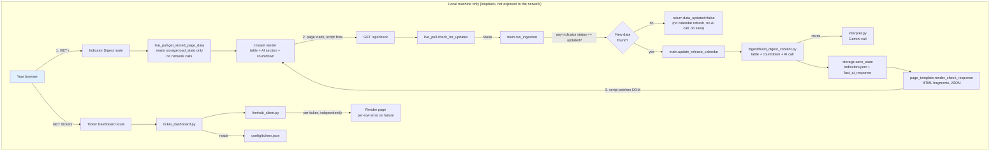
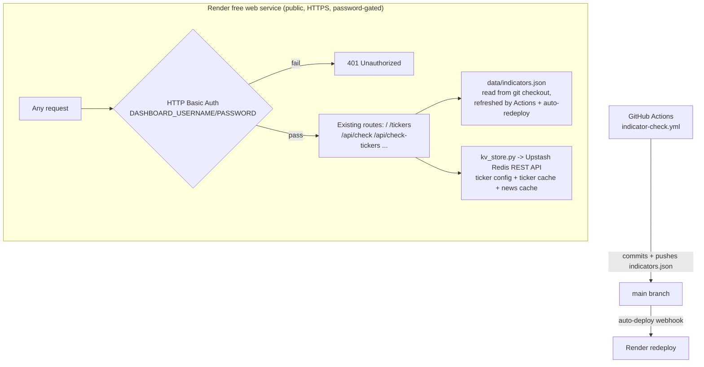

# V2 Technical Design — Web Dashboard

**Companion to:** investment_dashboard_requirements.md, v2_user_stories.md, v1_technical_design.md
**Adds to the v1 stack:** Flask (local web server) · Finnhub API (ticker price/52-week range) · Yahoo Finance's public chart endpoint (moving averages)
**Hosting:** local-only — `localhost`, bound to loopback only, started on demand

**Product shape:** v2 adds two web pages served by one local Flask app: the **Indicator Digest Page** (a browsable, live-refreshing version of the v1 digest email) and the **Ticker Dashboard** (new content). Both reuse v1's existing modules rather than duplicating logic — see Section 3.

---

## 1. Architecture Overview



**Why this shape:** the Indicator Digest Page drives the *same* ingestion and interpretation code the v1 email already uses, so the two surfaces can never disagree about "current." It's split into a fast synchronous path (`/`, stored data only) and a background path (`/api/check`, the actual live pull) so the reader never waits on FRED or Gemini, and a check that finds nothing new costs a FRED call but never a Gemini call. The Ticker Dashboard is genuinely new (Finnhub, not FRED) but follows the same pattern: a thin route handler, a data-assembly module, per-item error isolation.

## 2. Repository Structure (additions to v1)

```
/
├── config/
│   └── tickers.json              # ticker watchlist (Section 7 of requirements doc)
├── data/
│   ├── tickers.json               # gitignored snapshot cache — not the config file above
│   └── market_news.json          # gitignored market-news cache
├── src/
│   ├── web/
│   │   ├── app.py                 # Flask app: GET / and GET /tickers (fast renders), GET /api/check
│   │   │                          #   and GET /api/check-tickers (background live pulls)
│   │   ├── live_pull.py           # Indicator Digest Page: stored-only render + gated background check
│   │   ├── page_template.py       # HTML rendering for both pages (plain string-building, matching
│   │   │                          #   mailer/email_template.py's convention)
│   │   ├── ticker_dashboard.py    # config loading, per-ticker card assembly, stored-render/live-check split
│   │   ├── finnhub_client.py      # Finnhub API wrapper: quote, 52-week range (NOT candles — see 5.1)
│   │   └── yahoo_client.py        # Yahoo Finance chart-endpoint wrapper: daily closes for moving averages
│   ├── digest/
│   │   ├── build_digest_content.py  # builds {table, countdown, ai_result} from state — called by both
│   │   │                            #   post_release.py (weekly-throttled email) and live_pull.py (every
│   │   │                            #   page load), so table/countdown/AI-assembly logic lives in one place
│   │   ├── post_release.py        # calls build_digest_content(); throttle + email-send logic unchanged
│   │   ├── interpret.py           # (existing) — caller now persists the result
│   │   └── heuristics.py          # (existing, unchanged)
├── static/
│   └── dashboard.css              # served by Flask, plain CSS, no framework
└── run_web.sh                     # convenience script: activates venv, starts Flask on 127.0.0.1
```

No changes to `.github/workflows/indicator-check.yml` or the existing `fred/`, `storage/`, `mailer/` modules beyond what's noted above.

## 3. Data Schema Changes

### 3.1 `data/indicators.json` — `last_ai_response` field

v1 generated the AI summary fresh for each email and never persisted it. The Indicator Digest Page's fallback path needs a persisted copy to show when a live pull fails:

```json
{
  "last_digest_sent_at": "2026-09-04T14:00:00+00:00",
  "last_ai_response": {
    "summary": "Jobless claims ticked up while CPI cooled, suggesting...",
    "directional_read": "neutral",
    "generated_at": "2026-09-12T18:03:11+00:00"
  },
  "indicators": { "...": "unchanged from v1" }
}
```

- `last_ai_response` is overwritten (not appended) on every successful Gemini call — both from the weekly email (`post_release.py`) and from a page-triggered live pull (`live_pull.py`). Both call sites go through `build_digest_content()`, so this is one code path.
- If a live pull's Gemini call fails but the FRED fetch succeeds, `last_ai_response` is left untouched and the page falls back to it, labeled with its own `generated_at`.

### 3.2 `config/tickers.json`

```json
{
  "groups": {
    "stocks": ["SPY", "IVW", "DGRO"],
    "bonds": ["VGIT", "VGLT"],
    "international": ["VIGI", "VYMI", "EMB"],
    "sector": ["FTEC"],
    "individual": ["MSFT", "RELY"]
  }
}
```

`groups` is read as an open map — `ticker_dashboard.py` iterates whatever keys are present, in file order, rather than a fixed set of expected group names. **No group name may ever be hardcoded** in `ticker_dashboard.py` or `page_template.py`; both derive section headers directly from this file's keys.

Loaded fresh on every request to `/tickers` — an edit takes effect on the next page reload with no restart required.

## 4. Indicator Digest Page — Fast Render + Background Check Design

### 4.1 `GET /` — instant, stored-only render
`live_pull.get_initial_page_data()` builds the page entirely from `storage.load_state()` — `build_indicators_context`/`build_table`/`build_countdown` (all pure, no network) plus whatever `last_ai_response` is on file (or a placeholder, on a brand-new install). No FRED or Gemini call happens on this request. Each table row also renders a small inline-SVG trend sparkline (`page_template._render_sparkline_svg`).

### 4.2 `GET /api/check` — the actual live pull, called by the page's own script
`live_pull.check_for_updates()`:
1. `main.run_ingestion(state)` — re-fetches all 8 FRED series, same dedup-by-date logic as v1.
2. **Gate:** if no indicator's result has `status == "updated"`, return `{"data_updated": False}` immediately — no calendar refresh, no `build_digest_content` call, no `save_state`.
3. Only when at least one indicator *did* get a new value: `main.update_release_calendar(state)`, then `build_digest_content(state, updated_keys)` (table + countdown + a fresh Gemini call), then `storage.save_state(state)`. Returns `{"data_updated": True, "content": {...}, "checked_at": now}`.
4. Unexpected errors are caught and also reported as `{"data_updated": False}`.

`app.py`'s `/api/check` route converts a `data_updated: True` result into HTML fragments via `page_template.render_check_response` (reusing the same private `_render_table_section`/`_render_countdown_section`/`_render_ai_section` helpers the initial page uses) and returns them as JSON.

### 4.3 Client-side patching
The rendered page shows a `#checking-indicator` ("Checking for updates...") next to the header on load. The inline script removes it once `/api/check` settles, then — only if `data_updated` is true — replaces `#table-section` and `#countdown-section`'s `innerHTML`, and — only if `ai_html` is also non-null — replaces `#ai-section`'s `innerHTML` too. If FRED found new data but Gemini failed, the table/countdown update while the AI section is left as-is.

### 4.4 Known trade-off
`check_for_updates`'s `save_state()` call writes to the same `data/indicators.json` the GitHub Actions workflow commits. A local check that finds new data leaves that file locally modified until committed or discarded. Ingestion is idempotent (dedup by date), so this never corrupts history — the risk is purely a local working-tree diff. A check that finds nothing new never calls `save_state` at all.

## 5. Ticker Dashboard — Finnhub + Yahoo Integration Design

Finnhub's free tier returns 403 for `/stock/candle` regardless of symbol, resolution, or asset class. 52-week range instead comes from a different free Finnhub endpoint; moving averages get their daily closes from Yahoo Finance's public chart endpoint. (stooq.io was evaluated and rejected — its requests go through a client-side proof-of-work bot challenge.)

### 5.1 `finnhub_client.py`
Thin wrapper around two Finnhub REST endpoints, each independently callable so one ticker's failure can't affect another's:
- **Quote** (`/quote`) — current price, plus `d`/`dp` (change since last close)
- **52-week range** (`/stock/metric?metric=all`) — Finnhub precomputes `52WeekHigh`/`52WeekLow`, still free
- **General news** (`/news?category=general`) — filtered client-side to Finnhub's own `"top news"` tag

### 5.1a `yahoo_client.py`
Thin wrapper around Yahoo Finance's public, unauthenticated chart endpoint (`query1.finance.yahoo.com/v8/finance/chart/{symbol}`), used only for a year of daily closes to compute the 20/50/200-day simple moving averages. Implemented as a direct `requests` call rather than the `yfinance` library, to avoid its heavier dependency tree.

### 5.2 `ticker_dashboard.py`
For each ticker in `config/tickers.json`, independently:
1. Fetch quote + 52-week range/market cap/P/E (`finnhub_client.fetch_stock_metrics`, one `/stock/metric` call) from Finnhub and daily closes from Yahoo.
2. Compute the three moving averages (`MA_WINDOWS = (20, 50, 200)`) from the Yahoo close series.
3. On any failure for that ticker, catch it locally and mark that ticker's row as errored — the loop continues (same per-item isolation pattern as v1's `run_ingestion`). The row fails as a whole rather than partially.
4. Compute `pct_off_high = (week52_high - price) / week52_high * 100` (no new fetch).
5. Assemble one card dict per ticker: `{symbol, group, price, change, change_percent, week52_low, week52_high, pct_off_high, market_cap, pe_ratio, ma20, ma50, ma200, error: str | None}`. `market_cap`/`pe_ratio` can independently be `None` on an otherwise-successful card — Finnhub doesn't populate them for every symbol.

Cards are grouped for rendering using the `groups` structure from `config/tickers.json`, in file order — each group's display header is derived from its config key (e.g. `sector` → "Sector"). An unrecognized/invalid symbol is skipped with a logged warning before it reaches either client.

Fetches run concurrently via `ThreadPoolExecutor` (`max_workers=5` — deliberately modest, since maxing out Finnhub's free-tier rate limit risks trading slow-but-successful fetches for fast 429s). `main.run_ingestion()`/`update_release_calendar()` use the same pattern, one thread per indicator. Only the fetch calls run concurrently; state mutation and result-building run single-threaded afterward, and `executor.map`'s output-order guarantee keeps results grouped/ordered exactly as a sequential version would.

### 5.2a Rendering: one table per group
Columns: Ticker, Price, Change, 52-Week Range, % Off High, Market Cap, P/E, 20d/50d/200d MA, then a trailing unlabeled remove-button column (Section 5.2c). Two encodings follow the "status" pattern (a small fixed good→warning→critical scale, never color-alone):
- **52-week range** — an SVG gradient bar (green at the low end → amber at the midpoint → red at the high end) with a marker circle at the current price's position within `[low, high]`. Low/high are also printed as plain text below the bar.
- **Each moving average** — the value plus a signed `▲`/`▼` and percentage showing how far price sits above/below that average, colored green (above)/red (below).
- `pct_off_high` renders as a plain, uncolored number (the range bar already carries the status signal).
- `change`/`change_percent` render with the same signed `▲`/`▼` + color convention as the moving-average cells, plus the absolute $ change.
- `market_cap` (`page_template._format_market_cap`) renders as `$` plus the largest T/B/M suffix that keeps it readable (Finnhub's `marketCapitalization` comes back in millions of USD); `pe_ratio` renders as a plain one-decimal number. Either renders "n/a" when Finnhub has no value for that symbol — not an error, since it's common for micro-caps, non-US listings, or companies with no trailing earnings.
- A ticker with `ma20`/`ma50`/`ma200` as `None` (fewer closes than that window, e.g. a recent IPO) renders "n/a" in that cell.
- An errored ticker renders as a single row with `colspan` across the data columns (`_TICKER_DATA_COLUMN_COUNT`) and "Unable to load data.", followed by its own remove-button cell — removal doesn't depend on a successful fetch.

### 5.2b Sortable columns
Each `<tr>` (`page_template._render_ticker_row`) carries `data-symbol`/`data-pct-off-high` attributes (the latter empty for a pending/errored card); the Ticker and % Off High `<th>`s carry `class="sortable" data-sort-key="symbol"|"pctOffHigh"`. A click handler in `render_ticker_dashboard_page`'s inline `<script>`, event-delegated on `#ticker-groups`, reorders that `<table>`'s `<tbody>` rows in the DOM — no server round trip, no re-render. Clicking toggles ascending/descending (tracked via `sort-asc`/`sort-desc` classes on the `<th>`, which also drive the CSS arrow via `::after`); rows with an empty `data-pct-off-high` always sort last regardless of direction. Sorting is per table (per group), purely client-side state, and is lost on the next live refresh (`/api/check-tickers` replaces `#ticker-groups` wholesale, same as every other ticker-table state).

### 5.2c In-app ticker editing
`ticker_dashboard.add_ticker_to_group`/`remove_ticker_from_group` read-modify-write `config/tickers.json` directly. Only mutate an existing group's ticker list — creating/renaming/removing a group is still a hand-edit. `POST /api/tickers/add`/`/remove` (`app.py`) wrap these; invalid input raises `TickerConfigError`, returned as a 400. Each row's remove button and each group's add form (`page_template._render_remove_ticker_button`/`_render_add_ticker_form`) post to these routes and reload the page on success. The remove button renders as the row's own trailing `<td>`, not next to the ticker symbol, so it doesn't crowd the column readers scan first. Buttons are event-delegated on `#ticker-groups`, since that div's contents get replaced wholesale by `/api/check-tickers`.

### 5.3 Freshness
- **`data/tickers.json`** (gitignored — a cache, not the historical record `data/indicators.json` is) stores one snapshot per ticker: `{symbol: {price, change, change_percent, week52_low, week52_high, pct_off_high, market_cap, pe_ratio, ma20, ma50, ma200, fetched_at}}`.
- **`ticker_dashboard.get_initial_ticker_page_data()`** — stored-only, no network, mirrors `live_pull.get_initial_page_data()`. A ticker with no cached snapshot renders as a pending/"Loading…" row.
- **`ticker_dashboard.check_for_ticker_updates()`** — the real live pull, mirrors `live_pull.check_for_updates()`, with one difference: no "skip if nothing changed" gate — every check re-fetches every ticker live via `build_ticker_cards()` and persists every success back to the cache. A ticker whose live fetch fails resolves to its last cached snapshot silently if one exists, or the error state if not.
- **`/api/check-tickers`** calls `check_for_ticker_updates()` and returns `{"groups_html": ..., "news_html": ...}` (`page_template.render_ticker_check_response`) for the page's script to swap into `#ticker-groups` and `#market-news`.
- No per-ticker progressive/streaming updates — the bulk-fetch-plus-cache design plus concurrent fetching already deliver most of the UX gain for far less complexity.

## 5a. Cross-Page Navigation
Both `render_indicator_digest_page` and `render_ticker_dashboard_page` (`page_template.py`) render a shared `_render_nav(active_path)` — two links (`/`, `/tickers`) with the current page's link marked `.active`.

## 5b. US Stock Market News
- **`finnhub_client.fetch_market_news(limit=10)`** — `/news?category=general`, filtered to `category == "top news"` as the closest available signal to "US stock market news" (the raw feed is a broad wire, not market-specific).
- **Where it renders:** once, in a `#market-news` div at the top of `render_ticker_dashboard_page`, above `#ticker-groups`.
- **Freshness:** folded into `check_for_ticker_updates()`/`/api/check-tickers` rather than a new route. Its own cache file: **`data/market_news.json`** (gitignored), shape `{"headlines": [...], "fetched_at": ...}`. `ticker_dashboard.get_initial_market_news()`/`check_for_market_news()` mirror the ticker-card split at whole-section granularity.
- **Failure handling:** a failed live fetch with no cached fallback renders "Market news unavailable." rather than breaking the ticker tables below it; with a cached fallback, it degrades silently to the last known headlines.

## 6. Local Hosting & Access

- `app.py` binds explicitly to `127.0.0.1` (loopback only) — never `0.0.0.0`.
- No authentication layer: unnecessary when the app is never reachable outside the machine itself.
- Started manually when you want to check it (`./run_web.sh` or `flask --app src/web/app run`), not run continuously as a background service.
- `FINNHUB_API_KEY` is read via `os.environ.get`, same convention as every other secret in this codebase.

## 7. Secrets & Configuration (v2 additions)

| Secret | Purpose | Where used |
|---|---|---|
| `FINNHUB_API_KEY` | Authenticates Finnhub API requests | `finnhub_client.py` (local `.env` only — not a GitHub Actions secret) |

All v1 secrets (`FRED_API_KEY`, `GEMINI_API_KEY`, etc.) are reused as-is by the live-pull path, read from the same local `.env`.

## 8. Error Handling & Idempotency Summary (v2 additions)

- Live pull failure falls back to stored data + stored AI response, never an error page — the table/countdown and the AI section can independently be Live or Saved
- `save_state()` after a successful live pull reuses v1's existing dedup-by-date logic — safe to call from a second, independent trigger path (page load) in addition to the scheduled workflow
- Per-ticker try/catch in `ticker_dashboard.py` — one bad Finnhub call logs and shows an error row, doesn't block the other tickers
- An unrecognized ticker symbol in `config/tickers.json` is skipped with a logged warning before hitting the Finnhub client
- Local Flask app errors (e.g. a malformed `config/tickers.json`) render a plain error page rather than a stack trace — a minimal safeguard for a local single-user tool, not full input-validation hardening

## 9. Open Questions / Risks

- Per-visit Gemini/FRED calls (every Indicator Digest Page load, not just the scheduled check) — confirm this stays within free-tier rate limits under realistic single-user usage
- Local `data/indicators.json` working-tree diffs after a live pull (Section 4.4) — no automated reconciliation planned; revisit if it becomes annoying in practice

## 10. One-Time Setup Checklist (in addition to v1's)
- [ ] Add `flask` to `requirements.txt`, install
- [ ] Create a free Finnhub API key, add `FINNHUB_API_KEY` to local `.env`
- [ ] Create `config/tickers.json` from the format in Section 7 of the requirements doc
- [ ] Verify `app.run(host="127.0.0.1", ...)` — confirm the app is unreachable from another device on the same network

## 11. Hosted Live Dashboard (v2.1)

**Hosting:** Render free web service, connected to the GitHub repo with auto-deploy on push to `main`. The free tier spins the container down after ~15 minutes idle; the next request pays a cold start (tens of seconds) — an accepted tradeoff, since easy setup mattered more than avoiding that delay for a single low-traffic user.

### 11.1 Architecture



Nothing about the existing route logic changes — `app.py`, `live_pull.py`, and `ticker_dashboard.py`'s business logic are the same whether run locally or hosted. Only two things are added in front of/underneath them: an auth gate, and a storage backend swap for the two ticker-related JSON blobs that have no other durable home.

### 11.2 Auth gate
- `app.py` gains a `before_request` hook comparing the request's `Authorization: Basic` header against `DASHBOARD_USERNAME`/`DASHBOARD_PASSWORD` env vars — hand-rolled, no new dependency, matching this project's minimal-dependency convention
- If neither env var is set (the local-dev default), the hook is a no-op — local behavior is unchanged
- If set, every route (including `/api/check*`) requires valid credentials; a missing/incorrect header returns 401 with a `WWW-Authenticate` challenge so the browser prompts for credentials natively

### 11.3 `kv_store.py` — Upstash Redis wrapper
- Thin wrapper using `requests` against Upstash's REST API (`UPSTASH_REDIS_REST_URL` + `UPSTASH_REDIS_REST_TOKEN`, bearer-token auth) — no Redis client library needed, matching `finnhub_client.py`/`yahoo_client.py`'s plain-`requests` convention
- Two functions: `get_json(key) -> dict | None`, `set_json(key, value: dict)` — GET/SET against Upstash's REST command endpoint, JSON-encoded values
- Backend selection lives in `ticker_dashboard.py`: its config/cache load and save functions check whether `UPSTASH_REDIS_REST_URL` is set; if so, they route through `kv_store.py`, else they use the existing local-file `open()` calls unchanged — one function per operation, one branch inside it, not two parallel code paths per caller
- Keys: `ticker_config`, `ticker_cache`, `market_news_cache`

### 11.4 Seeding
`load_ticker_config()`, when Redis-backed and the `ticker_config` key doesn't exist yet, reads the repo's bundled `config/tickers.json` once and writes it to Redis before returning it — so a fresh deploy starts with the existing watchlist rather than an empty one. After that first write, the repo file is no longer consulted for a hosted deployment; local development is unaffected since it never touches Redis.

### 11.5 Deployment mechanics
- Flask's built-in dev server (`app.run(...)`) isn't meant for production; Render's start command instead runs `gunicorn` — add `gunicorn` to `requirements.txt`
- `app.py` binds `127.0.0.1` for local dev; Render needs `0.0.0.0` on the `$PORT` it assigns — gunicorn's `-b 0.0.0.0:$PORT` handles the bind, so `app.py`'s own `app.run(host="127.0.0.1", ...)` call stays under `if __name__ == "__main__":` and simply isn't what Render invokes
- This project has no `__init__.py`/package imports — every module does its own `sys.path.insert`. Confirm gunicorn (which imports `app.py` as a module rather than running it as `__main__`) still executes those inserts before the route handlers' imports run; add a minimal shim if the import order doesn't hold up under gunicorn's loader
- Render env vars needed, in addition to the existing `FRED_API_KEY`/`GEMINI_API_KEY`/`FINNHUB_API_KEY`: `DASHBOARD_USERNAME`, `DASHBOARD_PASSWORD`, `UPSTASH_REDIS_REST_URL`, `UPSTASH_REDIS_REST_TOKEN`. `GMAIL_*` are not needed on Render — the digest email still only sends from the GitHub Actions workflow

### 11.6 Open Questions / Risks
- Cold starts (seconds to under a minute) after idle spin-down — accepted tradeoff for free hosting
- Upstash's free-tier request quota (10K commands/day) should comfortably cover one user's occasional page loads, but worth confirming once real usage is observed
- gunicorn + this project's `sys.path.insert` import convention hasn't been verified together yet — flagged as the first thing to confirm once deployment is attempted
