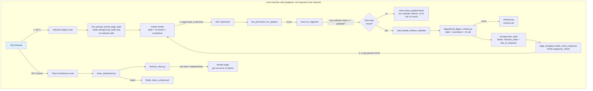
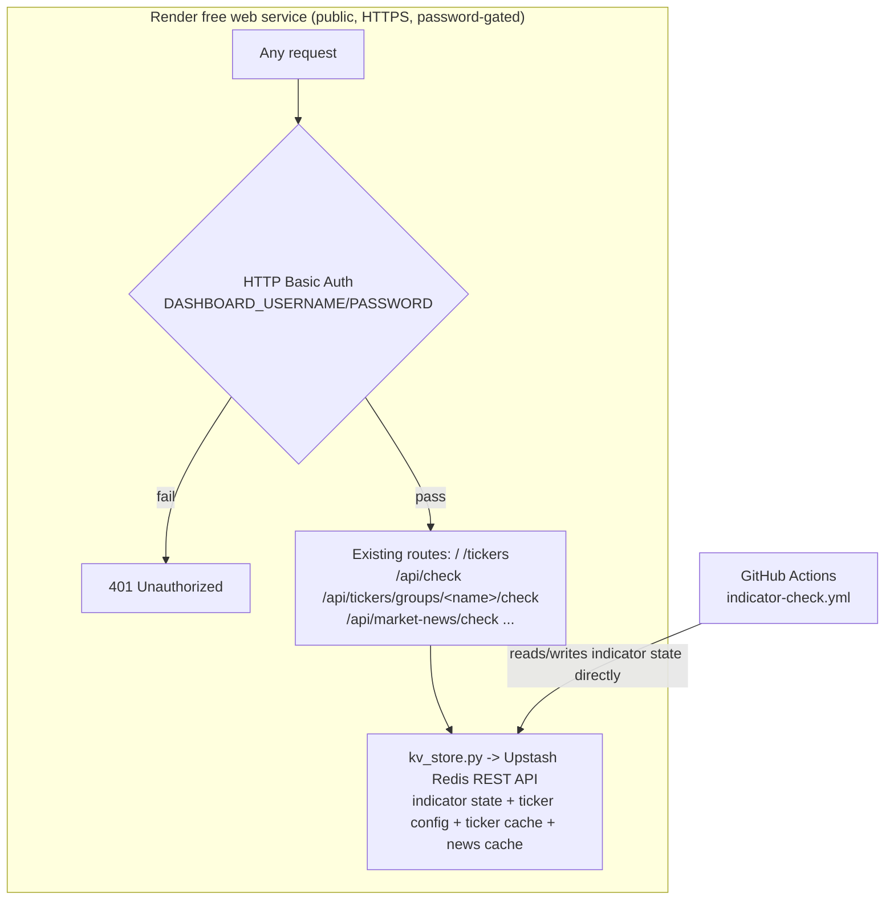

# V2 Technical Design — Web Dashboard

**Companion to:** investment_dashboard_requirements.md, v2_user_stories.md, v1_technical_design.md
**Adds to the v1 stack:** Flask (local web server) · Finnhub API (ticker price/52-week range)
**Hosting:** local-only — `localhost`, bound to loopback only, started on demand

**Product shape:** v2 adds two web pages served by one local Flask app: the **Indicator Digest Page** (a browsable, live-refreshing version of the v1 digest email) and the **Ticker Dashboard** (new content). Both reuse v1's existing modules rather than duplicating logic — see Section 3.

---

## 1. Architecture Overview



**Why this shape:** the Indicator Digest Page drives the *same* ingestion and interpretation code the v1 email already uses, so the two surfaces can never disagree about "current." It's split into a fast synchronous path (`/`, stored data only) and a background path (`/api/check`, the actual live pull) so the reader never waits on FRED or Gemini, and a check that finds nothing new costs a FRED call but never a Gemini call. The Ticker Dashboard is genuinely new (Finnhub, not FRED) but follows the same pattern: a thin route handler, a data-assembly module, per-item error isolation.

## 2. Repository Structure (additions to v1)

```
/
# config/tickers.json and data/*.json (originally: watchlist + ticker/news/
# indicator caches) were deleted from the repo on 2026-09-16 — everything
# lives in Redis only now (ticker_config, ticker_cache, market_news_cache,
# indicator_state), see Section 11.10.
├── src/
│   ├── web/
│   │   ├── app.py                 # Flask app: GET / and GET /tickers (fast renders), GET /api/check
│   │   │                          #   (background live pull) and, per ticker group, GET
│   │   │                          #   /api/tickers/groups/<name>/check plus GET /api/market-news/check
│   │   ├── live_pull.py           # Indicator Digest Page: stored-only render + gated background check
│   │   ├── page_template.py       # HTML rendering for both pages (plain string-building, matching
│   │   │                          #   mailer/email_template.py's convention)
│   │   ├── ticker_dashboard.py    # config loading, per-ticker card assembly, stored-render/live-check split
│   │   └── finnhub_client.py      # Finnhub API wrapper: quote, 52-week range (NOT candles — see 5.1)
│   ├── digest/
│   │   ├── build_digest_content.py  # builds {table, countdown, ai_result} from state — called by both
│   │   │                            #   post_release.py (weekly-throttled email) and live_pull.py (every
│   │   │                            #   page load), so table/countdown/AI-assembly logic lives in one place
│   │   ├── post_release.py        # calls build_digest_content(); throttle + email-send logic unchanged
│   │   ├── interpret.py           # (existing) — caller now persists the result
│   │   └── heuristics.py          # (existing, unchanged)
├── static/
│   └── dashboard.css              # served by Flask, plain CSS, no framework
└── run_web.sh                     # convenience script: activates venv, starts Flask on 127.0.0.1
```

No changes to `.github/workflows/indicator-check.yml` or the existing `fred/`, `storage/`, `mailer/` modules beyond what's noted above.

## 3. Data Schema Changes

### 3.1 `data/indicators.json` — `last_ai_response` field

v1 generated the AI summary fresh for each email and never persisted it. The Indicator Digest Page's fallback path needs a persisted copy to show when a live pull fails:

```json
{
  "last_digest_sent_at": "2026-09-04T14:00:00+00:00",
  "last_ai_response": {
    "summary": "Jobless claims ticked up while CPI cooled, suggesting...",
    "directional_read": "neutral",
    "generated_at": "2026-09-12T18:03:11+00:00"
  },
  "indicators": { "...": "unchanged from v1" }
}
```

- `last_ai_response` is overwritten (not appended) on every successful Gemini call — both from the weekly email (`post_release.py`) and from a page-triggered live pull (`live_pull.py`). Both call sites go through `build_digest_content()`, so this is one code path.
- If a live pull's Gemini call fails but the FRED fetch succeeds, `last_ai_response` is left untouched and the page falls back to it, labeled with its own `generated_at`.

### 3.2 `ticker_config` (originally `config/tickers.json`, superseded — see Section 11.10)

Originally a committed local file; as of the 2026-09-16 simplification (Section 11.10) the file was deleted and its content lives only in the `ticker_config` Redis hash. The logical shape is unchanged:

```json
{
  "groups": {
    "stocks": ["SPY", "IVW", "DGRO"],
    "bonds": ["VGIT", "VGLT"],
    "international": ["VIGI", "VYMI", "EMB"],
    "sector": ["FTEC"],
    "individual": ["MSFT", "RELY"]
  }
}
```

`groups` is read as an open map — `ticker_dashboard.py` iterates whatever keys are present, in config order, rather than a fixed set of expected group names. **No group name may ever be hardcoded** in `ticker_dashboard.py` or `page_template.py`; both derive section headers directly from these keys.

Loaded fresh on every request to `/tickers` — an edit (via the in-app editor; there's no file to hand-edit anymore) takes effect on the next page reload with no restart required.

## 4. Indicator Digest Page — Fast Render + Background Check Design

### 4.1 `GET /` — instant, stored-only render
`live_pull.get_initial_page_data()` builds the page entirely from `storage.load_state()` — `build_indicators_context`/`build_table`/`build_countdown` (all pure, no network) plus whatever `last_ai_response` is on file (or a placeholder, on a brand-new install). No FRED or Gemini call happens on this request. Each table row also renders a small inline-SVG trend sparkline (`page_template._render_sparkline_svg`).

### 4.2 `GET /api/check` — the actual live pull, called by the page's own script
`live_pull.check_for_updates()`:
1. `main.run_ingestion(state)` — re-fetches all 8 FRED series, same dedup-by-date logic as v1.
2. **Gate:** if no indicator's result has `status == "updated"`, return `{"data_updated": False}` immediately — no calendar refresh, no `build_digest_content` call, no `save_state`.
3. Only when at least one indicator *did* get a new value: `main.update_release_calendar(state)`, then `build_digest_content(state, updated_keys)` (table + countdown + a fresh Gemini call), then `storage.save_state(state)`. Returns `{"data_updated": True, "content": {...}, "checked_at": now}`.
4. Unexpected errors are caught and also reported as `{"data_updated": False}`.

`app.py`'s `/api/check` route converts a `data_updated: True` result into HTML fragments via `page_template.render_check_response` (reusing the same private `_render_table_section`/`_render_countdown_section`/`_render_ai_section` helpers the initial page uses) and returns them as JSON.

### 4.3 Client-side patching
The rendered page shows a `#checking-indicator` ("Checking for updates...") next to the header on load. The inline script removes it once `/api/check` settles, then — only if `data_updated` is true — replaces `#table-section` and `#countdown-section`'s `innerHTML`, and — only if `ai_html` is also non-null — replaces `#ai-section`'s `innerHTML` too. If FRED found new data but Gemini failed, the table/countdown update while the AI section is left as-is.

### 4.4 Known trade-off (superseded — see Sections 11.7/11.10)
~~`check_for_updates`'s `save_state()` call writes to the same `data/indicators.json` the GitHub Actions workflow commits. A local check that finds new data leaves that file locally modified until committed or discarded.~~ Indicator state moved to Redis-only (Section 11.7), then dropped its local-file fallback entirely (Section 11.10) — `save_state()` now always writes straight to the `indicator_state` Redis key, shared directly by every environment; there's no local file to leave modified. Ingestion is still idempotent (dedup by date), so concurrent writers can't corrupt history either way. A check that finds nothing new still never calls `save_state` at all.

## 5. Ticker Dashboard — Finnhub Integration Design

Finnhub's free tier returns 403 for `/stock/candle` regardless of symbol, resolution, or asset class. 52-week range instead comes from a different free Finnhub endpoint.

**Moving averages removed (2026-09-16):** the dashboard originally also showed 20-day/50-day/200-day simple moving averages, computed from a year of daily closes fetched from Yahoo Finance's public chart endpoint (`yahoo_client.py`, since Finnhub's free tier has no daily-close source and `/stock/candle` is blocked). That column set, the Yahoo fetch, and `yahoo_client.py` itself were all removed rather than kept as unused code — not replaced by anything. `ticker_cache` snapshots and `build_ticker_cards()` cards no longer carry `ma20`/`ma50`/`ma200` fields.

### 5.1 `finnhub_client.py`
Thin wrapper around two Finnhub REST endpoints, each independently callable so one ticker's failure can't affect another's:
- **Quote** (`/quote`) — current price, plus `d`/`dp` (change since last close)
- **52-week range** (`/stock/metric?metric=all`) — Finnhub precomputes `52WeekHigh`/`52WeekLow`, still free
- **General news** (`/news?category=general`) — filtered client-side to Finnhub's own `"top news"` tag

### 5.2 `ticker_dashboard.py`
For each ticker in the watchlist (`ticker_config` — originally `config/tickers.json`, see Section 3.2), independently:
1. Fetch quote + 52-week range/market cap/P/E/PEG (`finnhub_client.fetch_stock_metrics`, one `/stock/metric` call) from Finnhub.
2. On any failure for that ticker, catch it locally and mark that ticker's row as errored — the loop continues (same per-item isolation pattern as v1's `run_ingestion`). The row fails as a whole rather than partially.
3. Compute `pct_off_high = (week52_high - price) / week52_high * 100` (no new fetch).
4. If Finnhub's `pe_ratio` came back `None` and the ticker's group is one of `_EQUITY_ETF_GROUPS` (`stocks`, `international`, `sector` — Section 11.11), additionally try `yahoo_client.fetch_etf_pe_ratio` as a fallback. A `YahooApiError` here is caught and logged, never allowed to fail the card — Finnhub's own quote/range already succeeded.
5. Assemble one card dict per ticker: `{symbol, group, price, change, change_percent, week52_low, week52_high, pct_off_high, market_cap, pe_ratio, peg_ratio, error: str | None}`. `market_cap`/`pe_ratio`/`peg_ratio` can independently be `None` on an otherwise-successful card — Finnhub doesn't populate them for every symbol (never for a fund), and the Yahoo P/E fallback (where attempted) can independently come up empty too. `peg_ratio` has no equivalent Yahoo fallback (Section 11.12) — an ETF's PEG is always `None`.

Cards are grouped for rendering using the `groups` structure from `ticker_config`, in config order — each group's display header is derived from its config key (e.g. `sector` → "Sector"). An unrecognized/invalid symbol is skipped with a logged warning before it reaches the client.

Fetches run concurrently via `ThreadPoolExecutor` (`max_workers=5` — deliberately modest, since maxing out Finnhub's free-tier rate limit risks trading slow-but-successful fetches for fast 429s). `main.run_ingestion()`/`update_release_calendar()` use the same pattern, one thread per indicator. Only the fetch calls run concurrently; state mutation and result-building run single-threaded afterward, and `executor.map`'s output-order guarantee keeps results grouped/ordered exactly as a sequential version would.

### 5.2a Rendering: one table per group
Columns: Ticker, Price, Change, 52-Week Range, % Off High, Market Cap, P/E, PEG, then a trailing unlabeled remove-button column (Section 5.2c). Two encodings follow the "status" pattern (a small fixed good→warning→critical scale, never color-alone):
- **52-week range** — an SVG gradient bar (green at the low end → amber at the midpoint → red at the high end) with a marker circle at the current price's position within `[low, high]`. Low/high are also printed as plain text below the bar.
- `pct_off_high` renders as a plain, uncolored number (the range bar already carries the status signal).
- `change`/`change_percent` render with a signed `▲`/`▼` + color convention, plus the absolute $ change.
- `market_cap` (`page_template._format_market_cap`) renders as `$` plus the largest T/B/M suffix that keeps it readable (Finnhub's `marketCapitalization` comes back in millions of USD); `pe_ratio` renders as a plain one-decimal number, regardless of whether it came from Finnhub or the Yahoo ETF fallback (Section 11.11) — the cell doesn't distinguish the source; `peg_ratio` (Section 11.12) renders as a plain two-decimal number (matching Yahoo's own PEG display precision), always from Finnhub — there's no fallback for it. Any of the three renders "n/a" when there's nothing to show — not an error, since it's common for micro-caps, non-US listings, funds, or companies with no trailing earnings/growth estimate.
- An errored ticker renders as a single row with `colspan` across the data columns (`_TICKER_DATA_COLUMN_COUNT`) and "Unable to load data.", followed by its own remove-button cell — removal doesn't depend on a successful fetch.

### 5.2b Sortable columns
Each `<tr>` (`page_template._render_ticker_row`) carries `data-symbol`/`data-pct-off-high` attributes (the latter empty for a pending/errored card); the Ticker and % Off High `<th>`s carry `class="sortable" data-sort-key="symbol"|"pctOffHigh"`. A click handler in `render_ticker_dashboard_page`'s inline `<script>`, event-delegated on `#ticker-groups`, reorders that `<table>`'s `<tbody>` rows in the DOM — no server round trip, no re-render. Clicking toggles ascending/descending (tracked via `sort-asc`/`sort-desc` classes on the `<th>`, which also drive the CSS arrow via `::after`); rows with an empty `data-pct-off-high` always sort last regardless of direction. Sorting is per table (per group), purely client-side state, and is lost when that group's own `/api/tickers/groups/<name>/check` refresh lands (it replaces just that group's `.category-block` wholesale — other groups' sort state is untouched, per Section 11.8's per-group split).

### 5.2c In-app ticker editing
`ticker_dashboard.add_ticker_to_group`/`remove_ticker_from_group` read and write only their own group's field in the `ticker_config` Redis hash (Sections 11.9/11.10) — never the whole config. Only mutate an existing group's ticker list — creating/renaming/removing a group is still a direct Redis edit nobody's built a UI for. `POST /api/tickers/add`/`/remove` (`app.py`) wrap these; invalid input raises `TickerConfigError`, returned as a 400. The remove button renders as the row's own trailing `<td>`, not next to the ticker symbol, so it doesn't crowd the column readers scan first. Both are event-delegated on `#ticker-groups`, since that div's contents survive a child group block being swapped out.

**Remove (added 2026-09-16):** optimistic — the row is removed from the DOM immediately on confirm, before the `/api/tickers/remove` request resolves, and the page is *not* reloaded on success. A failure (network error or a 400 from `TickerConfigError`) re-inserts the row at its original position and shows an alert. This replaced an earlier `window.location.reload()`-on-success design that made every single-row removal pay the cost of a full watchlist live refresh just to reflect one row disappearing.

**Add (updated 2026-09-16, Section 11.9):** also no longer reloads the page. A successful add inserts a pending row for the new symbol directly into its group's table (built via DOM APIs, not string concatenation, so the symbol can't be interpreted as markup), then re-fires that same group's own `/api/tickers/groups/<name>/check` to fetch real data for it — reusing the same `checkGroup()` helper the background check uses.

### 5.3 Freshness
- **`ticker_cache`** (a Redis hash, one field per symbol — Section 11.8; no longer a local file) stores one snapshot per ticker: `{symbol: {price, change, change_percent, week52_low, week52_high, pct_off_high, market_cap, pe_ratio, peg_ratio, fetched_at}}`.
- **`ticker_dashboard.get_initial_ticker_page_data()`** — stored-only, no network, mirrors `live_pull.get_initial_page_data()`. A ticker with no cached snapshot renders as a pending/"Loading…" row.
- **`ticker_dashboard.check_for_ticker_updates()`** — the real live pull, mirrors `live_pull.check_for_updates()`, with one difference: no "skip if nothing changed" gate — every check re-fetches every ticker live via `build_ticker_cards()` and persists every success back to the cache. A ticker whose live fetch fails resolves to its last cached snapshot silently if one exists, or the error state if not. Takes an optional `config` subset (Section 11.8) so a caller can live-check just one group.
- **`/api/tickers/groups/<name>/check`** (Section 11.8) calls `check_for_ticker_updates(config={name: symbols})` for just that one group and returns `{"group_html": ...}` (`page_template.render_ticker_group_check_response`) for the page's script to swap into that group's own `.category-block`. **`/api/market-news/check`** is the equivalent for market news, returning `{"news_html": ...}` (`render_market_news_check_response`) for `#market-news`.
- No per-ticker progressive/streaming updates — per-group granularity plus concurrent fetching within a group already deliver most of the UX gain for far less complexity.

## 5a. Cross-Page Navigation
Both `render_indicator_digest_page` and `render_ticker_dashboard_page` (`page_template.py`) render a shared `_render_nav(active_path)` — two links (`/`, `/tickers`) with the current page's link marked `.active`.

## 5b. US Stock Market News
- **`finnhub_client.fetch_market_news(limit=10)`** — `/news?category=general`, filtered to `category == "top news"` as the closest available signal to "US stock market news" (the raw feed is a broad wire, not market-specific).
- **Where it renders:** once, in a `#market-news` div at the top of `render_ticker_dashboard_page`, above `#ticker-groups`.
- **Freshness:** its own route, `/api/market-news/check` (Section 11.8), fetched independently of any ticker group's own check. Its own cache key: **`market_news_cache`** (Redis whole-blob key, not a local file), shape `{"headlines": [...], "fetched_at": ...}`. `ticker_dashboard.get_initial_market_news()`/`check_for_market_news()` mirror the ticker-card split at whole-section granularity.
- **Failure handling:** a failed live fetch with no cached fallback renders "Market news unavailable." rather than breaking the ticker tables below it; with a cached fallback, it degrades silently to the last known headlines.

## 6. Local Hosting & Access

- `app.py` binds explicitly to `127.0.0.1` (loopback only) — never `0.0.0.0`.
- No authentication layer: unnecessary when the app is never reachable outside the machine itself.
- Started manually when you want to check it (`./run_web.sh` or `flask --app src/web/app run`), not run continuously as a background service.
- `FINNHUB_API_KEY` is read via `os.environ.get`, same convention as every other secret in this codebase.

## 7. Secrets & Configuration (v2 additions)

| Secret | Purpose | Where used |
|---|---|---|
| `FINNHUB_API_KEY` | Authenticates Finnhub API requests | `finnhub_client.py` (local `.env` only — not a GitHub Actions secret) |

All v1 secrets (`FRED_API_KEY`, `GEMINI_API_KEY`, etc.) are reused as-is by the live-pull path, read from the same local `.env`.

## 8. Error Handling & Idempotency Summary (v2 additions)

- Live pull failure falls back to stored data + stored AI response, never an error page — the table/countdown and the AI section can independently be Live or Saved
- `save_state()` after a successful live pull reuses v1's existing dedup-by-date logic — safe to call from a second, independent trigger path (page load) in addition to the scheduled workflow
- Per-ticker try/catch in `ticker_dashboard.py` — one bad Finnhub call logs and shows an error row, doesn't block the other tickers
- An unrecognized ticker symbol in the `ticker_config` watchlist is skipped with a logged warning before hitting the Finnhub client
- Local Flask app errors (e.g. a broken `ticker_config` load) render a plain error page rather than a stack trace — a minimal safeguard for a local single-user tool, not full input-validation hardening

## 9. Open Questions / Risks

- Per-visit Gemini/FRED calls (every Indicator Digest Page load, not just the scheduled check) — confirm this stays within free-tier rate limits under realistic single-user usage
- ~~Local `data/indicators.json` working-tree diffs after a live pull (Section 4.4)~~ — moot since Section 11.10: indicator state is Redis-only, no local file to diff

## 10. One-Time Setup Checklist (in addition to v1's)
- [ ] Add `flask` to `requirements.txt`, install
- [ ] Create a free Finnhub API key, add `FINNHUB_API_KEY` to local `.env`
- [x] ~~Create `config/tickers.json` from the format in Section 7 of the requirements doc~~ — superseded (Section 11.10): the watchlist lives in the `ticker_config` Redis hash instead; set up `UPSTASH_REDIS_REST_URL`/`TOKEN` in local `.env` and seed the watchlist through the in-app editor (or a one-off script) instead of creating a file
- [ ] Verify `app.run(host="127.0.0.1", ...)` — confirm the app is unreachable from another device on the same network

## 11. Hosted Live Dashboard (v2.1)

**Hosting:** Render free web service, connected to the GitHub repo with auto-deploy on push to `main`. The free tier spins the container down after ~15 minutes idle; the next request pays a cold start (tens of seconds) — an accepted tradeoff, since easy setup mattered more than avoiding that delay for a single low-traffic user.

### 11.1 Architecture



Nothing about the existing route logic changes — `app.py`, `live_pull.py`, `main.py`, and `ticker_dashboard.py`'s business logic are the same whether run locally or hosted. Only two things are added in front of/underneath them: an auth gate, and a storage backend swap for every JSON blob that has no other durable home — as of Story 11 (Section 11.7), that now includes indicator state alongside the two ticker-related blobs.

### 11.2 Auth gate — implemented
- `app.py`'s `_require_auth` `before_request` hook compares the request's `Authorization: Basic` header against `DASHBOARD_USERNAME`/`DASHBOARD_PASSWORD` env vars, via `secrets.compare_digest` — hand-rolled, no new dependency, matching this project's minimal-dependency convention
- If either env var is unset (the local-dev default), the hook is a no-op — local behavior is unchanged. (Read literally, the story's AC only calls out "neither set"; treating "only one set" the same way — auth off — was a deliberate choice to avoid an accidental lockout from a typo'd env var name.)
- If both are set, every route (including `/api/check*`) requires valid credentials; a missing/incorrect header returns 401 with a `WWW-Authenticate` challenge so the browser prompts for credentials natively
- Covered by `tests/test_app.py`; verified locally including under gunicorn (Section 11.5)

### 11.3 `kv_store.py` — Upstash Redis wrapper — implemented (extended, see Section 11.10)
- Thin wrapper using `requests` (a shared `requests.Session()`, Section 11.8) against Upstash's REST API (`UPSTASH_REDIS_REST_URL` + `UPSTASH_REDIS_REST_TOKEN`, bearer-token auth) — no Redis client library needed, matching `finnhub_client.py`'s plain-`requests` convention
- `get_json(key) -> dict | None` (`GET {url}/get/{key}`) / `set_json(key, value: dict)` (`POST {url}/set/{key}`) for a whole-blob key, plus `hset_json`/`hget_json`/`hgetall_json`/`hdel_json` (Sections 11.8/11.9) for per-field hash operations — all raise `KvStoreError` on any non-2xx response or malformed body. `is_configured()` still exists as a plain env-var check, but as of Section 11.10 nothing branches on it anymore — Redis is required unconditionally, so a caller either has both env vars set or gets a `KvStoreError` on the first call.
  **Caveat, since resolved:** the wire format below was originally implemented from Upstash's documented REST API pattern, not verified live — every operation (`get`/`set` and later the four hash commands) has since been confirmed directly against a real Upstash instance (see Sections 11.3's own later notes, and 11.8/11.9/11.10).
- ~~Backend selection lives in `ticker_dashboard.py`: ... each check `kv_store.is_configured()`; if true, they route through `kv_store.py`, else they use the existing local-file `open()` calls unchanged~~ — **removed entirely, Section 11.10**. Every one of these functions now calls `kv_store.py` unconditionally; there is no local-file branch left anywhere in `ticker_dashboard.py` or `storage.py`.
- Keys: `ticker_config`, `ticker_cache`, `market_news_cache` (plus `indicator_state`, added in Section 11.7, also Redis-only as of 11.10)
- A ticker/news cache failure (`KvStoreError`) is caught and degrades to the same empty/pending state a missing cache entry would produce (logged, not raised). A ticker **config** failure is *not* caught — it propagates out of `_load_raw_config`, per Story 9's AC that a broken watchlist load should fail loudly rather than silently render empty

### 11.4 Seeding — superseded, Section 11.10
~~`_load_raw_config()`, when Redis-backed and the `ticker_config` key doesn't exist yet, reads the repo's bundled `config/tickers.json` once and writes it to Redis before returning it — so a fresh deploy starts with the existing watchlist rather than an empty one. After that first write, the repo file is no longer consulted for a hosted deployment; local development is unaffected since it never touches Redis.~~ This seed-from-local-file step was removed entirely on 2026-09-16 (Section 11.10), along with the file itself (`config/tickers.json` was deleted from the repo). A wiped/fresh `ticker_config` key now simply comes back as an empty watchlist; recovery is re-adding tickers through the in-app editor, not an automatic reseed.

### 11.5 Deployment mechanics
- Flask's built-in dev server (`app.run(...)`) isn't meant for production; Render's start command instead runs `gunicorn` — added to `requirements.txt`
- `app.py` binds `127.0.0.1` for local dev; Render needs `0.0.0.0` on the `$PORT` it assigns — gunicorn's `-b 0.0.0.0:$PORT` handles the bind, so `app.py`'s own `app.run(host="127.0.0.1", ...)` call stays under `if __name__ == "__main__":` and simply isn't what Render invokes
- **Confirmed:** this project has no `__init__.py`/package imports — every module does its own `sys.path.insert`, run at module level as soon as the module is imported, before any of its own route-handler imports execute. Verified locally that gunicorn (which imports `app.py` as a module rather than running it as `__main__`) hits those inserts in the right order with no shim needed — `cd src/web && gunicorn app:app -b 127.0.0.1:8000` served `/` and `/tickers` correctly. The one requirement: gunicorn's working directory must be `src/web` itself (equivalently, `--chdir src/web app:app` from the repo root), since `app:app` is a bare module-name import with no package path to it. Render's start command: `gunicorn --chdir src/web app:app -b 0.0.0.0:$PORT`
- Render env vars needed, in addition to the existing `FRED_API_KEY`/`GEMINI_API_KEY`/`FINNHUB_API_KEY`: `DASHBOARD_USERNAME`, `DASHBOARD_PASSWORD`, `UPSTASH_REDIS_REST_URL`, `UPSTASH_REDIS_REST_TOKEN`. `GMAIL_*` are not needed on Render — the digest email still only sends from the GitHub Actions workflow
- **Gotcha confirmed live (1):** adding/editing env vars in Render's dashboard does not take effect on its own — there's a separate "Save, rebuild, and deploy" (or similar) confirmation that actually restarts the service with the new environment. Skipping it leaves the running container on its *old* environment indefinitely, with no error or warning. This produced a confusing false negative for Story 9: `/api/tickers/remove` returned `{"ok": true}` (a real, successful write — just to the container's own ephemeral local file, since `kv_store.is_configured()` was still reading the old, Redis-less environment) while Upstash's `ticker_config` never changed. `kv_store.py` itself was verified correct the whole time (a standalone script round-tripping `get_json`/`set_json` directly against the real Upstash instance passed cleanly) — the bug was purely "the new env vars were never actually live." Always confirm a redeploy actually happened (Render's Events tab shows a timestamp) after an env var change, not just that the values are saved in the form
- **Gotcha confirmed live (2):** once that redeploy did happen, `/tickers` 500'd with `requests.exceptions.InvalidSchema: No connection adapters were found for '"https://...upstash.io"/get/ticker_config'` — the literal quote characters in the error are the tell. Render's env var fields aren't shell-parsed, so pasting a value with surrounding quotes (`"https://..."` instead of `https://...`) keeps those quotes as part of the literal string. Fixed by editing the value in Render to remove the quotes, and hardened in `kv_store.py`'s `_clean_env_value()` — both `UPSTASH_REDIS_REST_URL` and `UPSTASH_REDIS_REST_TOKEN` now strip one matching pair of surrounding `"`/`'` characters (plus whitespace) before use, so this class of copy-paste mistake self-heals instead of surfacing as a cryptic traceback
- **Confirmed from a live deploy attempt:** gunicorn's default sync-worker timeout (30s) is too short for the original combined `/api/check-tickers` with a 36-ticker watchlist — each ticker makes up to 3 sequential external calls (Finnhub quote, Finnhub `/stock/metric`, Yahoo daily closes), and even batched 5 at a time (`build_ticker_cards`'s `ThreadPoolExecutor`), the whole request can exceed 30s on Render's free-tier CPU, especially before the timeout fix below. When it does, gunicorn kills the worker mid-request (`SystemExit: 1` from `handle_abort`, surfacing as a plain 500 with no useful error body). **Fix:** add `--timeout 120` to the start command: `gunicorn --chdir src/web app:app -b 0.0.0.0:$PORT --timeout 120`. Revisit the exact value if the watchlist grows much larger or Upstash calls (Section 11.3) add meaningfully more per-request latency
- **Concurrency (Story 12, Section 11.8):** this start command has no `--workers`/`--threads` flag, so gunicorn defaults to a single sync worker that processes exactly one HTTP request at a time. That made the per-group split in Section 11.8 pointless on Render as originally deployed — the browser fires all 6 requests (5 groups + market news) at once, but the server just queues and handles them one after another, so the last one in line still waits on every request ahead of it (observed live: the slowest group finishing ~35s after page load, well past any single group's own fetch time). **Fix:** add `--worker-class gthread --threads 8` to the start command: `gunicorn --chdir src/web app:app -b 0.0.0.0:$PORT --timeout 120 --worker-class gthread --threads 8`. Deliberately **threads, not `--workers N`**: `ticker_dashboard._ticker_state_lock` (Section 11.8) is a plain `threading.Lock`, which only guards against races within one process — separate worker *processes* wouldn't share it, reopening the exact cache-clobbering race the lock was added to close. Threads inside one process all share it correctly. 8 threads comfortably covers one page load's 6 concurrent requests with headroom for a second visitor/tab

### 11.6 Open Questions / Risks
- Cold starts (seconds to under a minute) after idle spin-down — accepted tradeoff for free hosting
- Upstash's free-tier request quota (10K commands/day) should comfortably cover one user's occasional page loads, but worth confirming once real usage is observed — Story 11 adds indicator state as a third consumer of the same quota, on top of ticker config/caches
- ~~gunicorn + this project's `sys.path.insert` import convention hasn't been verified together yet~~ — confirmed locally (Section 11.5), no shim needed
- ~~HTTP Basic Auth ... not yet exercised over real HTTPS on Render~~ — confirmed on the live Render deploy: the password prompt appears over HTTPS before any content renders, correct credentials get through, wrong ones don't
- ~~`kv_store.py`'s Upstash wire format ... not yet smoke-tested against a real Upstash database~~ — confirmed live twice now: once for ticker data (Story 9), again for indicator state (Story 11, Section 11.7)
- ~~`/api/check-tickers` fetching all 36 tickers in one request is a real scaling limit (Section 11.5's gunicorn-timeout fix papers over it, doesn't remove it) — a React frontend that sections the page so groups can update independently is the backlogged fix, not currently scheduled~~ — resolved directly instead: Story 12 (Section 11.8) split it into one request per group, without a frontend rewrite. Concurrent per-group requests introduced their own new risk (a shared-cache write race), also addressed in Section 11.8
- Story 11 (Section 11.7) means GitHub Actions and any hosted Render instance now both read-modify-write the *same* Redis-backed indicator state, with no locking — a race between an overlapping scheduled run and a live visitor's background check could lose one side's update. Accepted as low-severity and self-healing: ingestion is idempotent/dedup-by-date, so a lost update is simply rediscovered the next time either side successfully re-fetches that date from FRED. Same unguarded read-modify-write pattern Story 9 already accepted for the ticker config editor — not planning real transactional locking for a single-user tool
- Indicator history no longer has a git-diffable audit trail now that it lives in Redis instead of a committed file (Story 11) — a deliberate tradeoff, the same one Story 9 already made for ticker data

### 11.7 Indicator state moves to Redis too (Story 11) — implemented (local-file fallback since removed, Section 11.10)

**Why:** the original design (Story 10, "stays git-sourced") kept `data/indicators.json` committed by the scheduled GitHub Action and read from Render's own git checkout, specifically to avoid a second data store. Live usage surfaced a real gap: the AI response (`state["last_ai_response"]`) was only ever regenerated when an email also happened to be due (throttled to a weekly rollup), so a hosted visitor's own background check (`/api/check`) could compute a *fresher* AI take than what GitHub Actions had last committed — but that fresher result only ever landed on Render's own ephemeral disk, discarded on the next restart, while the git-committed (and therefore durable) AI response stayed stale until GitHub's own weekly-throttled cycle caught up. Moving indicator state to Redis, mirroring Story 9's ticker persistence, gives both the scheduled Action and any hosted visitor the same shared, durable state — there's no more "whoever ran most recently has the freshest copy, and it might not stick."

**`storage.py`:** `load_state`/`save_state` branch on `kv_store.is_configured()` exactly like `ticker_dashboard.py`'s functions do — Redis-backed (key `indicator_state`) when `UPSTASH_REDIS_REST_URL` is set, the unchanged local `data/indicators.json` file otherwise. `kv_store.py` stays in `src/web/`; `storage.py` adds `web/` to its own `sys.path` rather than moving the file, to avoid touching Story 9's already-working ticker code. Unlike the ticker/news caches (which degrade to an empty/pending state on a Redis failure), a `KvStoreError` here is **not caught** — indicator state is core data, not a cache, so a broken load fails loudly rather than silently acting as if there were no indicators at all.

**Seeding, added after a real incident:** the first version of this shipped *without* a seed-on-first-read step, unlike the ticker config's equivalent (`_load_raw_config`, Section 11.4). Render had already been given `UPSTASH_REDIS_REST_URL`/`TOKEN` (left over from Story 9) by the time this code deployed, so the very next live visit to the Indicator Digest Page found `indicator_state` completely empty and treated every indicator as brand new — persisting exactly one fresh FRED observation each, discarding the months of history that used to live in the git-committed file. Sparklines dropped to a single point; the AI response was also missing (its own live-check Gemini call didn't land that visit, and a genuine Gemini `503` high-demand period complicated the manual recovery). Fixed two ways: a one-time manual recovery (`python3 src/backfill.py` to repopulate ~12 recent real observations per indicator from FRED, then a manual `refresh_ai_response_if_updated` call once Gemini's `503`s cleared), and — the fix at the time — `load_state()` seeded from the local `data/indicators.json` file the first time the Redis key was empty, exactly mirroring `_load_raw_config`'s pattern: read the committed file, persist it to Redis, return it; a missing/corrupted local file fell back to `{"indicators": {}}` rather than raising.

**That seeding step was itself removed on 2026-09-16 (Section 11.10):** with the benefit of having actually recovered from this incident once already by hand, re-running `backfill.py` was judged sufficient going forward, and keeping a committed `data/indicators.json` file around purely as a seed source (never read for anything else, easy to mistake for something that should stay in sync with live Redis) wasn't worth the confusion it invited. The file was deleted from the repo; a fresh/wiped `indicator_state` key now simply comes back as `{"indicators": {}}` with no automatic reseed, same as `ticker_config`'s equivalent change.

**GitHub Actions (`indicator-check.yml`):** the "Commit and push updated indicator data" step is gone entirely — the workflow now passes `UPSTASH_REDIS_REST_URL`/`UPSTASH_REDIS_REST_TOKEN` (new repo secrets, separate from Render's env vars) to `python3 src/main.py`, which writes straight to Redis via the same `storage.py` used everywhere else. The `permissions: contents: write` grant that authorized the old commit step is removed too, since nothing in the workflow touches git anymore.

**Decoupling AI refresh from the email throttle (`post_release.py`, `main.py`):** previously, the only place `build_digest_content()` (and therefore the Gemini call) ran was inside the email send-decision, gated on the same weekly throttle as the send itself. That's now split into two independent functions `main()` calls every cycle:
- `refresh_ai_response_if_updated(state, updated_keys)` — regenerates and persists `state["last_ai_response"]` whenever *this run's* `run_ingestion` found at least one genuinely new value. No throttle at all; every 6h cycle with new data gets a fresh AI take.
- `maybe_send_digest_email(state)` — decides whether to email, based purely on the *currently persisted* state: a content fingerprint (`_digest_fingerprint`, below) differing from what was last emailed, AND at least `MIN_DIGEST_INTERVAL` (7 days) having passed. Has no `interpret_fn` parameter at all — it structurally cannot call Gemini itself, only reuse whatever `refresh_ai_response_if_updated` most recently persisted (this cycle or several cycles ago). This is what prevents a duplicate AI call every time both functions happen to run in the same cycle.

**Content fingerprint (`_digest_fingerprint`):** a SHA-256 hash of each indicator's `(key, latest value, latest date)` plus the AI's `directional_read` — deliberately **excluding** the free-text AI summary, since Gemini can reword an unchanged situation differently between calls and that alone shouldn't trigger a resend. Replaces the old design's `indicators_updated_since(state, last_sent_at)` timestamp scan as the *gate*; that function still exists and is still used, but now only to name what's new in the email's subject line once a send is already decided.

**Net effect:** a hosted visitor's `/api/check` background check now writes to the exact same Redis-backed state the scheduled Action reads and writes — its result is no longer thrown away on the next container restart, closing the original gap. Verified locally against the real Upstash instance (round-tripping `storage.load_state`/`save_state`, and the seeding path specifically, through throwaway keys, same pattern used to verify `kv_store.py` for Story 9); confirmed live end to end via a manually-triggered GitHub Actions run against real Redis/FRED/Gmail, which completed successfully and sent a real digest email.

### 11.8 Ticker Dashboard: per-group live checks (Story 12) — implemented

**Why:** the original `/api/check-tickers` live-fetched the entire ~36-ticker watchlist (across all 5 config groups) in one request before returning anything, occasionally taking 30+ seconds and needing the `--timeout 120` gunicorn fix (Section 11.5) to avoid a bare 500 on Render. A full React componentization of the Ticker Dashboard was considered as the eventual fix (backlog item, `docs/investment_dashboard_requirements.md` Section 5) and explicitly rejected in favor of a smaller, direct change on the existing string-templating approach: split the one request into one per group.

**`app.py`:** `GET /api/check-tickers` is replaced by `GET /api/tickers/groups/<group_name>/check` (looks `group_name` up in `load_ticker_config()`, 404s with `{"error": "unknown group: ..."}` if it isn't a real group) and `GET /api/market-news/check` (a thin wrapper around the unchanged `check_for_market_news()`). Both are gated by `_require_auth` exactly like every other route — no exemption.

**`ticker_dashboard.check_for_ticker_updates()`** already accepted an optional `config` subset before this change (used internally by tests); the per-group route just calls it as `check_for_ticker_updates(config={group_name: symbols})`. Tracing the function confirmed this was already merge-safe: it loads the *full* stored cache, mutates only the symbols present in whatever `config` subset it was given, and saves the full merged dict back — a subset call can't drop other groups' cached data by construction.

**`page_template.py`:** `_render_ticker_groups` tags each group's `.category-block` with `data-group="<name>"`. `render_ticker_check_response` (which returned `{"groups_html": ..., "news_html": ...}` for the whole watchlist) is replaced by `render_ticker_group_check_response(group_name, cards)` (`{"group_html": ...}`, reusing `_render_ticker_groups` with a single-entry dict — it already just loops, so this needed no new rendering code) and `render_market_news_check_response(market_news)` (`{"news_html": ...}`, wrapping the unchanged `_render_market_news`). `render_ticker_dashboard_page`'s inline `<script>` now does `querySelectorAll('.category-block[data-group]')`, fires one fetch per block plus one for market news, all concurrently, and replaces (`outerHTML`) or patches (`#market-news`'s `innerHTML`) only the section that resolved — `Promise.allSettled` across every one of those requests decides when to clear the "Checking for updates" indicator. Sorting/remove/add-ticker handlers are untouched, since they're event-delegated on the still-stable `#ticker-groups` ancestor.

**New race, and why a lock was the wrong fix for it:** before this split, only one combined live-check request ever ran per page load, so a read-modify-write race on the shared `data/tickers.json`/Redis cache was only a *theoretical* risk. Splitting into 5 concurrent per-group requests turns that into a near-certainty: the old `check_for_ticker_updates` loaded the *full* cache, merged in only its own group's fresh results, and saved the full (merged) cache back — if two groups' calls both loaded before either saved, the second save silently reverted the first group's freshly-fetched values. The first fix attempt wrapped that load-merge-save in a process-local `threading.Lock`. That's the wrong shape of fix: a lock only ever protects one process's own memory, not the genuinely concurrent multi-user traffic a hosted deployment actually has to handle (two different visitors' overlapping requests, or multiple gunicorn worker processes, share nothing a Python-level lock can reach) — it also does nothing to remove the underlying anti-pattern, a whole-cache read-modify-write, which exists specifically to paper over the fact that a live fetch is slow, not because the data model needs it.

**Real fix: per-symbol writes, no shared blob to race over.** `ticker_dashboard.save_ticker_snapshot(symbol, snapshot, path)` replaces the load-merge-save cycle. Redis-backed, the ticker cache changed from a single JSON-blob string key to a Redis **hash** (`ticker_cache`, one field per symbol) — `kv_store.hset_json`/`hgetall_json` (new, alongside the existing `get_json`/`set_json`) wrap Upstash's `HSET`/`HGETALL`. A successful fetch calls `hset_json("ticker_cache", symbol, snapshot)` directly: one atomic per-field write that never reads or touches any other field, so any number of groups, any number of concurrent users, or any number of gunicorn worker processes writing different (or even the same) symbol can never clobber each other's data — no lock needed anywhere in the Redis path. `check_for_ticker_updates` only ever *reads* the full cache once now, and only if some ticker's live fetch failed and needs a fallback value; a read never conflicts with anything. Locally, `save_ticker_snapshot` still does a read-modify-write of the single JSON file (a plain file has no per-key write primitive the way a hash does), scoped to one symbol and guarded by `_ticker_state_lock` — much lower stakes than the Redis case, since it's one developer's own machine, not a shared multi-user store, and losing that race just leaves one ticker stale until the next check.

Verified directly against the real Upstash instance, not just reasoned about: confirmed the `HSET`/`HGETALL` wire format live (a throwaway key, cleaned up after); then ran all 5 real config groups (36 tickers) concurrently against live Finnhub/Yahoo, inspected the resulting `ticker_cache` hash afterward, and found every successfully-fetched symbol present with no cross-group loss (the handful of Canadian-bank-ticker symbols that came back missing were genuine per-ticker Finnhub fetch failures, unrelated to this change, not data loss from a race).

**One-time Redis migration, hit live during this verification:** the existing `ticker_cache` key (created by the old `set_json`/`get_json` code) is a Redis *string*; `HSET`/`HGETALL` against a key still holding the old string type fails (`WRONGTYPE`, surfaced by Upstash as an HTTP 400) rather than silently converting it. `load_ticker_state`'s existing `KvStoreError` handling degrades that failure to an empty cache exactly like any other cache-read failure — but it does **not** self-heal on its own, since every subsequent `HSET` attempt hits the same type conflict and never succeeds in creating the hash. The key needs deleting once (confirmed live: `DEL ticker_cache` via the Upstash REST API, then a fresh live check correctly repopulated it as a hash with real market data). **This must happen once on the shared Upstash instance the moment this code deploys to Render** — until then, the *currently-deployed* (pre-Story-12-hash) code reading that now-hash-typed key will itself degrade to an empty cache the same way (every ticker shows "Loading…" until the old code's own `set_json` write next overwrites it back to a string, or this fix is deployed) — a temporary, self-consistent, harmless state either way, matching this cache's long-documented "fine to lose" tolerance, just worth knowing about rather than being surprised by.

**Global fetch-concurrency cap, a related fix found in the same investigation:** `build_ticker_cards`'s own `max_workers` (default 5) only ever bounded concurrency *inside one call* — safe when the ticker page's background check was one combined request (one call, one pool). Once the page began firing one `build_ticker_cards` call per group concurrently, each with its own `max_workers`-sized pool, the *global* number of simultaneous Finnhub/Yahoo fetches could reach `group_count × max_workers` instead of staying capped at `max_workers`. Added `ticker_dashboard._fetch_concurrency_limit`, a module-level `threading.Semaphore`, that every `_build_card` call acquires regardless of which group/thread pool it's running in.

**Correction, found live one deploy later:** the first version set this semaphore to `5`, assumed to match the old design's safety margin. That was itself the bottleneck it introduced: with all 36 tickers now funneling through only 5 global slots, total completion time became `⌈36 / 5⌉ ≈ 8` sequential rounds — observed live as *every* group uniformly taking 35-40s, worse than before (previously at least the smaller groups finished fast; now everything queued behind the same 5 slots regardless of which group it belonged to). Verified directly rather than guessing again: fetched all 36 real tickers (108 Finnhub/Yahoo calls) at `max_workers=20` against the live APIs — **2.09s total, zero errors** — proving Finnhub's free tier tolerates this concurrency level fine and the tight cap was solving a problem measurement never actually confirmed at the API level. Raised to `25` (comfortably above the current watchlist's natural per-group-pool sum of 21 — `3+3+5+5+5` if every group's own pool were maxed at once — so it rarely if ever actually binds, while still guarding against unbounded growth if the watchlist gains many more groups). Confirmed live: the same 5-group check that took 35-40s dropped back to ~1.2-4.5s per group. Process-local, same as `_ticker_state_lock`'s local-file branch — see the gthread-vs-`--workers` reasoning below.

**Local dev:** `app.py`'s `if __name__ == "__main__":` block now passes `threaded=True` to `app.run(...)`, since Werkzeug's dev server is single-threaded by default and would otherwise queue the 5 concurrent per-group requests one at a time, masking the whole point of the split during local testing.

**Render gap, found live after this shipped:** the app-code half of this story (the routes, the per-symbol writes, `threaded=True` locally) doesn't by itself make the split concurrent *on Render* — that also needs the host's own request-handling concurrency, which the existing gunicorn start command doesn't have (Section 11.5 predates this story and only ever needed `--timeout 120`, since the old design was one request, not several meant to run at once). Without it, gunicorn's default single sync worker queues the 6 per-page-load requests (5 groups + market news) and handles them one at a time — observed live as the fastest group returning in a couple of seconds and the slowest only after ~35s. The fix is the `--worker-class gthread --threads 8` addition documented in Section 11.5 — **threads specifically**, not `--workers N` separate processes: unlike the ticker-cache write (now Redis-atomic and safe across any number of processes), `_fetch_concurrency_limit` above is still a process-local semaphore, and separate worker processes wouldn't share it, silently widening the global Finnhub/Yahoo concurrency cap back out to `worker_count × 25`. Applied on Render.

**Still slow on Render specifically after all of the above, resolved:** with the gthread start command applied and the semaphore raised to 25, the same 5-group check that completes in well under 5 seconds locally took 12-40 seconds on Render. Since the code and settings are now identical between the two environments, this points away from a remaining app-level concurrency bug and toward Render's own free-tier resource ceiling — most plausibly CPU throttling under concurrent load (each Finnhub/Yahoo call's TLS handshake is real CPU work, and pushing more parallel connections at a throttled fractional CPU can make things *worse*, not better, unlike genuinely idle-waiting I/O concurrency). Two responses so far:
- **`finnhub_client.py`/`yahoo_client.py`/`kv_store.py` now share one `requests.Session()` each** instead of calling bare `requests.get`/`.post`, so repeated calls to the same host (up to 72 Finnhub + 36 Yahoo calls per full watchlist check, plus per-symbol Upstash `HSET`s) reuse an already-negotiated connection instead of paying a fresh DNS+TCP+TLS handshake every single call. Measured a real improvement locally (36 tickers at `max_workers=20`: 2.09s → 1.13s). **Confirmed live on Render:** this closed the remaining gap — group checks that were taking 12-40s dropped to under 10s, matching the local profile closely enough that further CPU-throttling investigation (Render's Metrics dashboard) wasn't needed.

**Tests:** `tests/test_page_template.py` — `data-group` attribute on every block; the script's fetch targets are the new per-group/market-news routes, not the old combined one; `render_ticker_group_check_response`/`render_market_news_check_response` return their fragments without the full page shell (replacing the deleted `TestRenderTickerCheckResponse`). `tests/test_app.py` — a known group's route calls `check_for_ticker_updates` with only that group's symbols; an unknown group 404s without calling the fetch function at all; the market-news-check route returns its fragment; both new routes are covered by the existing auth-gate test pattern. Full pre-existing suite (295 tests) passes unmodified.

### 11.9 Add-ticker without a page reload, and `ticker_config` as a Redis hash — implemented

**Add-ticker UX:** `render_ticker_dashboard_page`'s inline `<script>` no longer calls `window.location.reload()` on a successful add. Instead: the per-group check logic used by the initial background check was factored into a shared `checkGroup(block)` helper; on a successful `/api/tickers/add`, the script inserts a pending row (`Loading…`, matching `_render_ticker_row`'s pending-state markup, built via DOM APIs rather than string concatenation so the user-provided symbol can't be interpreted as markup) directly into the target group's `<tbody>` — skipping the insert if a row for that symbol is already shown, in case the add was a no-op (already-present symbol) — then calls `checkGroup()` on that same group to fetch real data for it, same as any other background refresh. No full page reload for either add or remove now.

**`ticker_config` is also a Redis hash, mirroring the ticker-cache fix in Section 11.8:** `add_ticker_to_group`/`remove_ticker_from_group`'s old Redis path read the *entire* config (`get_json`), mutated one group's list, and wrote the whole thing back (`set_json`) — the same read-modify-write shape that caused the ticker-cache race, just at much lower risk (a config edit is a deliberate, infrequent user action, not something firing automatically and concurrently on every page load the way the per-group live checks do). Fixed for consistency: `ticker_config` is now a hash, one field per **group** (not per ticker, since a group's ticker list is the natural atomic unit here — there's no per-symbol structure worth sharding further, and `load_ticker_config`'s consumers all want a whole group's list at once), each field `{"symbols": [...], "order": i}`. `add_ticker_to_group`/`remove_ticker_from_group` now `hget_json`/`hset_json` only their own group's field.

**Order preservation needed an extra piece the ticker cache didn't:** "groups render in file order" is a real, documented requirement (Story 2), and reads happen via `HGETALL`-equivalent (`hgetall_json`), so hash field order matters here in a way it never did for the ticker cache (whose values are only ever looked up by key, never iterated in hash order). Verified live, empirically, before committing to this design: wrote fields to a throwaway hash in the real config's group order (`stocks, bonds, international, sector, individual`) and read them back — Upstash's `HGETALL` returned them alphabetized (`bonds, individual, international, sector, stocks`), confirming Redis hash fields do **not** reliably preserve insertion order. Each field's value therefore carries an explicit `order` index (the position in the original file/config), and `load_ticker_config` sorts by that index after `hgetall_json` rather than trusting the hash's own field order. `_save_raw_config` (now used only for the one-time seed-from-local-file path, not the hot edit path) assigns `order` from `enumerate()` over the source config's group order.

**`market_news_cache` deliberately left as a plain string blob:** it's always replaced wholesale (`{"headlines": [...], "fetched_at": ...}`) by `check_for_market_news`, never read-modify-written — there's no per-item structure to shard by (one list, not independent pieces), so `get_json`/`set_json` is already the right tool and forcing a hash here would add complexity with no correctness benefit.

**One-time Redis migration, same pattern as Section 11.8's ticker-cache one:** the existing `ticker_config` key was a string from the old design; confirmed live (`TYPE ticker_config` → `string`), deleted it, and confirmed a fresh `load_ticker_config()` call re-seeded it correctly as a hash with the real watchlist, group order intact, then confirmed `add_ticker_to_group`/`remove_ticker_from_group` both round-trip correctly against the real instance (add, verify, remove, verify) and that an unknown group still raises `TickerConfigError` without writing anything.

**Tests:** `tests/test_kv_store.py` — new `hget_json` (one-field read, `None` for a missing field, wire format confirmed live). `tests/test_ticker_dashboard.py`'s `TestRedisBackedTickerConfig` rewritten for the hash shape: seeding writes one `hset_json` call per group with the right `order`; reads restore file order even when the mocked hash is handed back deliberately out of order; add/remove each read and write only their own group's field; a concurrent-edit test confirms two different groups' edits never touch each other's field. `tests/test_page_template.py` — asserts the add-ticker script no longer contains `location.reload` and does contain `checkGroup`. Full suite (312 tests) passes.

### 11.10 Redis as the only source of truth, everywhere — local-file fallback removed entirely — implemented

**Why:** every function that touched the watchlist, the two ticker/news caches, or indicator state had a local-file branch (`if kv_store.is_configured(): ... else: <open a local file>`) dating back to Stories 9/11, intended for local development without a Redis account. In practice, this project's local dev has always pointed `.env` at the same live Upstash instance Render uses — the "local file" branch was never actually exercised day-to-day. Its continued existence had a real cost: during a live-testing session for Section 11.9's `ticker_config` hash migration, a mix of (a) the author's own test script mistakenly removing a ticker (`IVW`) that was already real production data, not a test fixture, and (b) the user's own legitimate edits to the live site's watchlist while testing, produced a Redis state that no longer matched the committed `config/tickers.json`. That divergence was initially and wrongly read as "data corruption," when the existing design (Section 11.4/11.9: seed once from the file, then never touch it again for a hosted deployment) already made this exact divergence expected and harmless — a stale snapshot from whenever it was last committed is not a second source of truth to reconcile against, only a one-time bootstrap. Keeping a file around that *looked* authoritative but wasn't invited exactly this kind of mistake.

**Decision:** remove the local-file code path entirely, for both the ticker dashboard and indicator state, rather than keep maintaining two parallel storage modes for a distinction that wasn't real in practice. `UPSTASH_REDIS_REST_URL`/`TOKEN` are now required unconditionally, wherever this app runs.

**`ticker_dashboard.py`:**
- `_load_raw_config`/`load_ticker_config` — no more `is_configured()` branch, no more `path` parameter, no more seed-from-local-file step (that was Section 11.4/11.9's job; removed along with the branch). Always `hgetall_json(_TICKER_CONFIG_KEY)`, sorted by each field's `order` index.
- `add_ticker_to_group`/`remove_ticker_from_group` — no more `path` parameter; always `hget_json`/`hset_json` on their own group's field (Section 11.9's design, now the *only* path rather than one of two).
- `load_ticker_state`/`save_ticker_state`/`save_ticker_snapshot`/`delete_ticker_snapshot` — no more `path`/`state_path` parameters or local-file branch; always the Redis hash operations from Section 11.8.
- `load_market_news_state`/`save_market_news_state`/`get_initial_market_news`/`check_for_market_news` — same simplification, no more `path` parameter.
- `get_initial_ticker_page_data`/`check_for_ticker_updates` — dropped the now-meaningless `state_path` parameter.
- **`_ticker_state_lock` (a `threading.Lock`) was deleted entirely** — it existed solely to guard the local file's read-modify-write in `save_ticker_snapshot`/`delete_ticker_snapshot`'s local branch. With that branch gone, every write is either a single Redis key operation (whole-blob `market_news_cache`) or an atomic per-field hash write (`ticker_config`, `ticker_cache`) — neither needs a lock.
- Module docstring rewritten top to bottom to describe the Redis-only design as the current, only behavior, not a fallback-guarded one.

**`storage.py`:** `load_state`/`save_state` lost their `path` parameter and local-file branch entirely — always `get_json`/`set_json` against `indicator_state`. A wiped/fresh key returns `{"indicators": {}}`; recovering real history is `backfill.py`'s job (already the real recovery mechanism used during the H.12 incident, Section 11.7), not an automatic reseed. `main.py`/`backfill.py`/`live_pull.py` needed no changes — they already called `load_state()`/`save_state(state)` with no path argument.

**Deleted from the repo:** `config/tickers.json` and `data/indicators.json` (both previously git-tracked, both now fully unread by any code — keeping them around would just be misleading, exactly the mistake this section's "why" describes). `.gitignore`'s `data/tickers.json`/`data/market_news.json` entries were also removed, since those files are never written anymore either — nothing local-file-shaped remains for any of the four keys.

**Accepted tradeoff, explicit:** a wiped or brand-new Redis key now has no automatic reseed anywhere. Indicator state recovers via `python3 src/backfill.py` (re-fetches recent observations from FRED — accepted as sufficient specifically because it already proved itself as the real recovery path during the H.12 incident). A wiped watchlist recovers by re-adding tickers through the in-app editor — no tooling exists for bulk-restoring a watchlist from a backup; not built, since the user judged this acceptable for a single-user tool's very-infrequent worst case.

**Tests:** `tests/test_storage.py` rewritten — `TestLoadSaveState` now mocks `get_json`/`set_json` directly (a small in-memory fake-Redis helper for round-trip tests) instead of writing to temp files; the old seed-related tests (`test_load_seeds_from_local_file_when_redis_key_absent`, etc.) were deleted, since there's no seeding left to test. `tests/test_ticker_dashboard.py` rewritten comprehensively: every test class that previously wrote to a temp-dir local file (`TestLoadTickerConfig`, `TestAddTickerToGroup`, `TestRemoveTickerFromGroup`, `TestTickerStatePersistence`, `TestMarketNewsPersistence`, `TestGetInitialMarketNews`, `TestCheckForMarketNews`) now mocks the relevant `hset_json`/`hget_json`/`hgetall_json`/`hdel_json`/`get_json`/`set_json` calls instead, via shared `config_hash()`/`fake_hash_store()` test helpers that build a small in-memory Redis-hash stand-in for realistic read-after-write round trips; the separate `is_configured()`-gated `TestRedisBacked*` classes were folded into the main test classes, since there's only one mode left to test, not two. The real smoke test against the live watchlist (`test_default_config_path_loads_the_live_watchlist`) was deleted — there's no local file left to smoke-test, and the suite must still run without real Upstash credentials. Full suite (300 tests) passes.

### 11.11 Aggregate P/E for ETFs via Yahoo, as a Finnhub fallback — implemented

**Why:** Finnhub's `/stock/metric` never populates `peTTM` (or its fallback fields) for a fund — confirmed live against every symbol in `stocks`/`bonds`/`international`/`sector` — so every ETF's P/E column showed "n/a", even though an aggregate P/E across a fund's holdings is a real, commonly-shown stat (Yahoo's own ETF Overview page displays one). Finnhub's dedicated ETF endpoints (`/etf/profile`, `/etf/holdings`) that might carry this are 403 on the free tier, same wall as `/stock/candle`.

**Decision:** add it anyway, accepting real fragility, scoped to just the groups where it's meaningful. The only free source found is Yahoo's undocumented `quoteSummary` endpoint (`modules=topHoldings`), whose `equityHoldings.priceToEarnings` is an aggregate P/E across the fund's holdings — but as an earnings *yield* (E/P), not a P/E multiple (confirmed: SPY's raw `0.04035` inverts to ≈24.8, matching Yahoo's own displayed P/E). Unlike the plain, fully public chart endpoint this app already used for daily closes (removed alongside moving averages, Section 5's changelog), `quoteSummary` now sits behind an undocumented cookie + "crumb" anti-bot gate — no account or API key, but no stability guarantee either, and Yahoo could change or remove it without notice.

**`yahoo_client.py` (reintroduced with an entirely different purpose):**
- `fetch_etf_pe_ratio(symbol)` — the crumb handshake (`_fetch_crumb`/`_get_crumb`/`_refresh_crumb_if_unchanged`, a module-level cache guarded by a `threading.Lock` since concurrent per-group fetches can race on it) followed by the `quoteSummary` request. Returns `None` (not an error) for either legitimate "nothing to report" case — `result` empty (symbol isn't a fund, e.g. an individual stock) or `priceToEarnings.raw == 0` (a fund with no equity holdings, e.g. a bond fund). Raises `YahooApiError` for a genuine problem (network failure, a 401 that persists after one crumb refresh, an unexpected response shape).
- A 401 (an expired/invalidated crumb) triggers exactly one retry against a freshly-fetched crumb; `_refresh_crumb_if_unchanged` avoids every thread that hit a stale crumb at once each paying for its own redundant refetch.

**`ticker_dashboard.py`:**
- `_EQUITY_ETF_GROUPS = frozenset({"stocks", "international", "sector"})` — deliberately hardcoded by name, unlike every other group-name reference in this module (which reads whatever groups the config defines): this is a fact about which groups hold equity funds, not a rendering detail, so a newly added fund group needs adding here too. `bonds` has no equity P/E to speak of; `individual` already gets a real per-company P/E from Finnhub directly.
- `_build_card` — after Finnhub's own fetch, if `pe_ratio` is `None` and the ticker's group is in `_EQUITY_ETF_GROUPS`, calls `_fallback_etf_pe_ratio`, which tries `fetch_etf_pe_fn` (injectable, defaults to `yahoo_client.fetch_etf_pe_ratio`) and catches `YahooApiError` specifically, logging and returning `None` — never allowed to fail a card whose price/range already succeeded via Finnhub.
- `build_ticker_cards`/`check_for_ticker_updates` both gained a `fetch_etf_pe_fn` parameter (defaulting to the real fetch), threaded through the same way `fetch_quote_fn`/`fetch_metrics_fn` already are, for test injectability.

**Rendering:** no changes needed — `page_template._render_pe_cell` already treated any non-`None` `pe_ratio` uniformly and any `None` as "n/a"; it doesn't distinguish which source produced the value.

**Tests:** `tests/test_yahoo_client.py` (new) mocks `yahoo_client._session.get`, covering the earnings-yield inversion, both legitimate-`None` cases, the 401-retry-once behavior, crumb caching across calls, and genuine failure paths — same no-real-network convention as `test_finnhub_client.py`. `tests/test_ticker_dashboard.py` gained dedicated tests for the fallback being applied only to `_EQUITY_ETF_GROUPS`, skipped when Finnhub already has a value, and degrading silently (not erroring the card) on a `YahooApiError`; every pre-existing `build_ticker_cards`/`check_for_ticker_updates` call in the file was updated to pass an explicit `fetch_etf_pe_fn` (usually a no-op `lambda s: None`) so the pre-existing "stocks" group fixtures don't accidentally trigger a real Yahoo call. Full suite (302 tests) passes. Confirmed live against the real Redis-configured watchlist: `stocks`/`sector` symbols returned real P/E values (e.g. SPY ≈24.8, DGRO ≈22.6), `bonds` symbols correctly stayed `None` without attempting the fallback at all, zero errors.

### 11.12 PEG ratio column — implemented

**Why:** requested as a follow-on to Section 11.11's ETF P/E work. Finnhub's `/stock/metric` (the same call already made for P/E) also carries `pegTTM`/`forwardPEG` for individual companies — no new fetch needed. Checked whether Yahoo's `quoteSummary` could provide an equivalent fallback for the ETF groups the way it does for P/E: it can't. `topHoldings.equityHoldings` (the module Section 11.11 uses) has exactly four fields — `priceToEarnings`, `priceToBook`, `priceToSales`, `priceToCashflow` — no PEG equivalent at all, for any fund tested. (Yahoo does have `defaultKeyStatistics.pegRatio` behind the same crumb gate, but only for individual companies with their own quote page, e.g. confirmed for AAPL — the exact case Finnhub already covers directly, so there was nothing to add there either.)

**`finnhub_client.py`:** `fetch_stock_metrics` gained a fifth return field, `peg_ratio` — prefers `pegTTM`, falling back to the forward-looking `forwardPEG` (mirroring `pe_ratio`'s trailing→fallback pattern). Degrades to `None`, not an error, exactly like `market_cap`/`pe_ratio`.

**`ticker_dashboard.py`:** `_SNAPSHOT_FIELDS` gained `"peg_ratio"` (so the cache save/load/pending-card helpers, which all iterate that tuple generically, needed no further changes); `_build_card` passes `metrics.get("peg_ratio")` straight through in both the success and error dict literals (which aren't built from `_SNAPSHOT_FIELDS` and needed an explicit new key each). Deliberately **no** `_fallback_etf_pe_ratio`-style fallback was added for PEG — there's nothing on the Yahoo side to fall back to (see "Why" above), so an ETF's `peg_ratio` is always `None`.

**`page_template.py`:** `_render_peg_cell` mirrors `_render_pe_cell` (same "n/a" convention) but at two decimal places rather than one, since PEG is conventionally read to that precision (Yahoo's own site shows e.g. `2.67`). New `PEG` column header and cell added after `P/E`; `_TICKER_DATA_COLUMN_COUNT` bumped 6→7 (used for the pending/error rows' `colspan`). `dashboard.css`'s `.ticker-table` comment (column count, used only for a styling-rationale note, not a selector) updated from 8→9 data+remove columns.

**Tests:** `tests/test_finnhub_client.py` gained the PEG-fallback-to-`forwardPEG` case and updated the existing full-dict-equality assertions to include `peg_ratio`. `tests/test_ticker_dashboard.py` gained a passthrough/missing-degrades pair (mirroring the existing market-cap/P-E ones) plus an explicit test asserting no ETF fallback exists for PEG even when the (unused) `fetch_etf_pe_fn` would return a value. `tests/test_page_template.py`'s `make_card`/`make_pending_card` helpers gained a `peg_ratio` field (every existing call now needs it, since `_render_ticker_row` reads `card['peg_ratio']` directly rather than via `.get`) plus new header/render/n/a tests. Full suite (306 tests) passes. Confirmed live against the real watchlist: individual stocks show real PEG values (e.g. AAPL 2.93, NVDA 0.58, TSLA 23.11), every ETF across all groups correctly shows "n/a".

### 11.13 Valuation-context data for a future AI feature (growth/quality stats + sector-peer P/E) — data-only, implemented

**Why:** in response to "can AI tell whether a ticker is a discount/fair/overpriced," the answer was: only as well as the inputs allow, and a raw P/E/PEG number alone isn't much better than a hardcoded threshold. Four categories of missing context were identified: (1) a peer/sector P/E benchmark, (2) the ticker's own historical valuation (not available anywhere for free — would need this app to start persisting its own readings over time, not built here), (3) growth/quality stats to distinguish a real discount from a value trap, (4) analyst consensus. Checked live which of 1/3/4 are free: `/stock/recommendation` (analyst buy/hold/sell trends) is free-tier, confirmed against AAPL/AMD/SPY (empty `[]` for the ETF, as expected); `/stock/price-target` is 403, same free-tier wall as `/stock/candle`. The user explicitly scoped this pass to **1 and 3 only**, deliberately as data with no new table columns — the AI feature itself, and analyst-recommendation data, remain unbuilt.

**Growth/quality (`finnhub_client.fetch_stock_metrics`):** gained `revenue_growth`/`eps_growth`/`roe`/`net_margin`/`debt_to_equity`/`dividend_yield` (Finnhub's `revenueGrowthTTMYoy`/`epsGrowthTTMYoy`/`roeTTM`/`netProfitMarginTTM`/`totalDebt/totalEquityAnnual`/`dividendYieldIndicatedAnnual`) — the same `/stock/metric` call already made for P/E/PEG, no new fetch, each independently `None` when Finnhub has nothing (always the case for an ETF). A deliberately curated subset, not exhaustive — Finnhub's response carries dozens more fields.

**Sector-peer P/E (`ticker_dashboard.py`):**
- `finnhub_client.fetch_company_industry` — new, wraps `/stock/profile2`, returns its `finnhubIndustry` string (Finnhub's own proprietary taxonomy, e.g. "Semiconductors", not a GICS sector name) or `None`. Confirmed free-tier.
- `_SECTOR_ETF_BY_INDUSTRY` — a curated, deliberately partial dict mapping a handful of these industry strings to one of the Fidelity MSCI sector-ETF tickers this watchlist's `sector` group already tracks (`FTEC`, `FCOM`, `FDIS`, `FSTA`, `FHLC`, `FNCL`, `FREL`, `FUTY`). An unmapped industry (or a GICS sector this watchlist has no fund for, e.g. Energy/Industrials/Materials) just means no benchmark — not an error, and meant to grow incrementally as new industries are observed rather than trying to enumerate Finnhub's taxonomy upfront.
- `_NON_COMPANY_GROUPS = _EQUITY_ETF_GROUPS | {"bonds"}` — the inverse of `_EQUITY_ETF_GROUPS`'s allowlist pattern: any group *not* in this set is assumed to hold individual companies and gets a sector-benchmark attempt, so a newly added individual-stock group works without a code change (at the cost of one harmless wasted Finnhub profile call if a future non-equity, non-bond group ever appears).
- `_sector_benchmark(symbol, group_name, fetch_industry_fn)` — returns `(sector_pe_ratio, sector_symbol)`, both `None` for a ticker in `_NON_COMPANY_GROUPS`, an unmapped industry, or a caught `FinnhubApiError`/`KvStoreError`. Deliberately reads the mapped sector ETF's own `pe_ratio` straight out of `ticker_cache` (`hget_json`, whatever was last fetched for it, possibly stale) rather than re-fetching fresh — the `sector` group already computes this value (via Section 11.11's Yahoo fallback) on its own schedule, so refetching here would be redundant and would need the Yahoo-fallback logic duplicated.
- `_build_card`/`build_ticker_cards`/`check_for_ticker_updates` all gained a `fetch_industry_fn` parameter (defaulting to the real fetch), threaded through the same way `fetch_etf_pe_fn` already is.

**Card/cache shape:** `_SNAPSHOT_FIELDS` (and so every card, and `ticker_cache`'s stored shape) gained all eight new fields: `revenue_growth`, `eps_growth`, `roe`, `net_margin`, `debt_to_equity`, `dividend_yield`, `sector_pe_ratio`, `sector_symbol`. None are rendered — `page_template.py` needed no changes at all for this section.

**Tests:** `tests/test_finnhub_client.py` gained `TestFetchCompanyIndustry` plus growth-field parse/degrade cases for `fetch_stock_metrics` (its full-dict-equality assertions updated for the six new keys). `tests/test_ticker_dashboard.py` gained: growth/quality passthrough and missing-degrades pairs; a sector-benchmark-attached case (mocking `ticker_dashboard.hget_json`); an unmapped-industry case (asserting `hget_json` is never even called); a not-yet-cached-ETF case; a "not attempted for `_EQUITY_ETF_GROUPS`/`bonds`" case across all four groups; and a lookup-failure-degrades-gracefully case. One pre-existing test (`test_does_not_fall_back_to_etf_pe_for_bonds_or_individual`) needed an explicit `fetch_industry_fn=lambda s: None` added — its `"individual"` iteration would otherwise have hit the real default `fetch_company_industry` and attempted a genuine (if immediately-failing, for lack of an API key) network call. Full suite (318 tests) passes. Confirmed live against the real watchlist: AMD/AAPL (Semiconductors/Technology) correctly benchmark against `FTEC`, RELY (Financial Services) against `FNCL`, all growth/quality fields populated, zero errors; confirmed the rendered `/tickers` page and its per-group `/api/tickers/groups/<name>/check` response are both unchanged (no new columns, new fields absent from the HTML).

### 11.14 AI valuation section (Story 14) — implemented

**Why:** built directly on top of Section 11.13's groundwork, at the user's explicit request, once a hand-run sample prompt (against real live watchlist data) proved the two data inputs gathered there — a sector-peer P/E benchmark and growth/quality stats — were enough for a genuinely useful discount/fair/overpriced read, including correctly flagging low-P/E "value trap" stocks (INTC, QCOM in the sample run) rather than calling them discounts. Two refinements came out of that sample run and the user's follow-up: (1) individual tickers must be grouped under "Discount"/"Fair"/"Overpriced" headings, not a flat list; (2) the response must be cached, with any failure (a Gemini quota error confirmed as the real-world failure mode during the sample run) falling back to the last cached valuation — the same graceful-degradation contract `check_for_ticker_updates` already has for a single ticker's price, requested explicitly so this section behaves the same way under a quota outage.

**`src/web/ticker_valuation.py` (new module):** mirrors `src/digest/interpret.py`'s conventions (same model `gemini-3.8-flash`, same structured-output-via-pydantic-schema approach, same exception-per-call contract) but lives under `src/web/` since it's Ticker-Dashboard-specific.
- `SYSTEM_PROMPT` instructs the model to: judge each ETF group as discount/fair/overpriced from its P/E and % off 52-week high (bonds judged on price-in-range alone, explicitly not inventing a P/E read); give **every single** individual-group ticker a verdict with no omissions (the sample run's first attempts returned an empty list without this explicit instruction); and call out a low P/E paired with weak growth/high debt as a value trap rather than a discount.
- `ValuationResponse`/`GroupVerdict`/`TickerVerdict` (pydantic models) define the structured output: `{overview: str, groups: [{group, verdict, reasoning}], individual_tickers: [{symbol, verdict, reasoning}]}`.
- `build_user_prompt(cards_by_group)` formats one `### Group: <name>` section per group (price/% off high/P/E for ETF groups; all the Section 11.13 fields too for `individual`), each ticker as a one-line summary — same shape validated in the hand-run sample.
- `interpret_ticker_valuation(cards_by_group, client=None)`: calls Gemini, raises `TickerValuationError` for any API failure (including a quota `429`), missing credentials, unusable response, or no data at all. Post-processes the parsed response: `groups` is **sorted in code** (discount→fair→overpriced) rather than trusted to whatever order Gemini returns them in — confirmed in the sample run that Gemini's own list order didn't reliably match its own stated ranking. `individual_tickers` is regrouped by verdict into `individual_by_verdict` (`_group_individual_by_verdict`), in the *original watchlist's* order within each bucket (not the AI's response order), so the page doesn't reshuffle for reasons unrelated to an actual verdict change; a ticker the AI omits despite the instruction not to is logged and simply absent, not fatal.

**`ticker_dashboard.py`:**
- `_TICKER_VALUATION_CACHE_KEY = "ticker_valuation_cache"` (a new whole-blob Redis key, `get_json`/`set_json` — like `market_news_cache`, always replaced wholesale, no per-item structure to shard).
- `MIN_VALUATION_INTERVAL = timedelta(hours=6)`: unlike every other background check on this page (which just gate on "does cached data exist yet"), this one is throttled by *time* — confirmed live that `gemini-3.8-flash`'s free tier caps at 20 requests/day total, shared with the indicator digest's own calls on the same model, so refreshing on every page load/background check would be unworkable.
- `load_ticker_valuation`/`save_ticker_valuation`: same degrade-on-`KvStoreError` pattern as `load_market_news_state`/`save_market_news_state`.
- `_build_valuation_cards(config, stored)`: reshapes `ticker_cache` snapshots (keyed by symbol) into the `{group: [card, ...]}` shape `ticker_valuation.py` expects, attaching `symbol` to each (a snapshot doesn't carry it as its own field). A symbol with no snapshot yet is skipped entirely — nothing useful to tell the AI about it. Deliberately reads from the *cache*, not a fresh live fetch — a valuation call doesn't need millisecond-fresh prices, and refetching everything here would double the Finnhub/Yahoo traffic a page load already costs.
- `get_initial_ticker_valuation()`: stored-only, instant, mirrors `get_initial_market_news()` — a pending placeholder when nothing's ever been cached.
- `check_for_ticker_valuation(now, interpret_fn, config)`: within the throttle window, returns the cached value **without calling Gemini at all**. Outside it, builds cards from the cache and calls `interpret_fn`; on success, persists with a fresh `generated_at` and returns it. On `TickerValuationError` — the quota-exhausted case confirmed live — falls back to whatever's cached (if anything), or the pending placeholder if nothing's ever succeeded. Never raises to its caller.

**`page_template.py`:**
- `VALUATION_STYLE` reuses `email_template.DIRECTIONAL_STYLE`'s existing bullish/bearish/neutral palette directly (discount→bullish, fair→neutral, overpriced→bearish) rather than inventing a second green/red/gray scale. `VALUATION_HEADINGS` maps each verdict to its display label ("Discount"/"Fair"/"Overpriced"). `VALUATION_DISCLAIMER` is a new, separate constant from `email_template.DISCLAIMER` — that one is worded specifically around "indicator trends", wrong for this section.
- `_render_ticker_valuation(valuation)`: the overview paragraph, a `.valuation-group-badges` row (one colored badge per ETF group, in the already-sorted order), then a `.valuation-columns` 3-column grid — one column per verdict, each listing that bucket's tickers with their reasoning. A `pending` valuation renders a muted "AI valuation not yet available." placeholder.
- `render_ticker_dashboard_page(grouped_cards, market_news, valuation=None)` gained the `valuation` parameter (defaulting to a pending placeholder so the ~40 pre-existing tests that don't care about this section didn't need updating), rendering `#ticker-valuation` as the *first* content block — above `#market-news` — per the user's explicit "at the top of the page" request. The page's inline script fires `/api/tickers/valuation/check` alongside the per-group and market-news checks, patching `#ticker-valuation`'s innerHTML, folded into the same `Promise.allSettled` that clears the "Checking for updates..." indicator.
- `render_ticker_valuation_check_response(valuation)`: `{"valuation_html": ...}`, mirroring `render_market_news_check_response`.
- `dashboard.css` gained `.valuation-group-badges`/`.valuation-group-badge`/`.valuation-columns`/`.valuation-column` — a 3-column grid collapsing to 1 column under 700px, matching the rest of the page's mobile-friendly layout; badge/column accent colors are set inline per-verdict (same convention as `#ai-section`'s directional badge), not in the stylesheet.

**`app.py`:** `GET /tickers` also calls `get_initial_ticker_valuation()`. New route `GET /api/tickers/valuation/check` → `check_for_ticker_valuation()` → `render_ticker_valuation_check_response()`, gated by the same `_require_auth` hook as every other route.

**Tests:** `tests/test_ticker_valuation.py` (new) mocks the Gemini client the same way `tests/test_interpret.py` does — covering prompt building, the discount-first/overpriced-last group sort, original-watchlist-order preservation within a verdict bucket, a ticker the AI omits, empty-data/API-error/quota-error/malformed-JSON/no-credentials failure cases. `tests/test_ticker_dashboard.py` gained `TestTickerValuationCachePersistence`, `TestGetInitialTickerValuation`, and `TestCheckForTickerValuation` (throttle-skip, past-throttle re-call, AI-failure-falls-back-to-cached, AI-failure-with-nothing-cached, and a check that the cards passed to `interpret_fn` come from the cache rather than a live fetch). `tests/test_page_template.py` gained rendering tests for the pending placeholder, overview/group-badge rendering, verdict-heading grouping, section placement (above market news and ticker groups), script wiring, and HTML-escaping. `tests/test_app.py` gained an auth-required check and a happy-path check for the new route. Full suite (353 tests) passes.

**Confirmed live, end to end, against the real Redis instance and a real (quota-exhausted) Gemini call:** (1) with nothing ever cached and Gemini returning a real `429 RESOURCE_EXHAUSTED`, the route returned 200 with the pending placeholder, never an error; (2) after seeding a stale (7-hour-old) cached entry directly in Redis and re-triggering past the throttle window, a real 429 was hit again and the route correctly fell back to serving the seeded cached content unchanged; (3) after seeding a fresh cached entry, the same route returned it without making any Gemini request at all (confirmed via the absence of a new outbound HTTP log line) — the throttle-skip path.

### 11.15 HTTP connection pool sizing across the three shared `requests.Session`s — found live, fixed

**Why:** the user reported `WARNING Connection pool is full, discarding connection: finnhub.io. Connection pool size: 10` while running the app. `requests`' `HTTPAdapter` defaults every host's connection pool to 10 slots; `finnhub_client.py`/`yahoo_client.py`/`kv_store.py`'s shared `_session`s (mounted specifically so concurrent calls from `ticker_dashboard.py`'s thread pools reuse already-open connections instead of paying a fresh DNS+TCP+TLS handshake each time) never overrode that default. `ticker_dashboard._fetch_concurrency_limit` (a `threading.Semaphore`, currently `25`, Section H's own history) already permits up to 25 concurrent per-ticker fetches globally — each of which can call Finnhub (`fetch_quote`, `fetch_stock_metrics`, and, since Section 11.13, `fetch_company_industry`), and possibly Yahoo (Section 11.11's ETF P/E fallback) or Redis (Section 11.13's `hget_json` sector-benchmark lookup) too. Once concurrency actually reached that ceiling, urllib3 started discarding (closing, not reusing) the 11th-and-beyond simultaneous connection to a given host — silent, not a request failure, but exactly the handshake cost these shared sessions exist to avoid, on every single one of those discarded connections.

**Fix:** each of the three modules' `_session` now mounts `HTTPAdapter(pool_maxsize=25)` explicitly for `https://` (the only scheme any of them ever uses), matching `_fetch_concurrency_limit`'s ceiling rather than `requests`' generic default. `pool_connections` (the number of distinct per-host pools kept before the LRU-est is evicted) was left untouched — each module only ever talks to one or a few fixed hostnames, so it was never the bottleneck; only the per-host pool *size* was.

**Verification:** reproducing the exact warning on demand was unreliable once Finnhub's own per-minute rate limit started kicking in from the session's own heavy live testing (a separate, unrelated throttle) — so this was verified by mechanism and by outcome instead: (1) confirmed via `Session.get_adapter(...)` that all three sessions now report `pool_maxsize=25`; (2) ran a full live watchlist background check (`build_ticker_cards` against the real config, real Finnhub/Yahoo APIs) with urllib3's own warning logger monkeypatched to capture every call — zero pool-related warnings, 31/31 tickers fetched successfully. No test suite changes were needed or possible for this one: connection-pool behavior is a property of the real network stack, not something a mocked `_session.get` can exercise.

### 11.16 `yahoo_client.py` removed entirely (2026-09-18) — its only consumer was already a hidden column

**Why:** two changes landed the same day and together made Section 11.11's ETF P/E fallback pure overhead. First, its `getcrumb` handshake was dropped on the belief that `quoteSummary` didn't actually need it (Render had been 429ing on the crumb endpoint specifically) — but a plain GET without a crumb turned out to fail too, with a live `401 Unauthorized` on every call, on both Render and local dev. Second, and independently, Section 11.13's individual-group-only column gating (2026-09-17) had already stopped rendering P/E for every group this fallback targeted (`stocks`/`international`/`sector`) — so even a working fallback would have been fetching a value nothing displayed. With the endpoint now also broken outright, there was no remaining reason to keep it: it was making a background-check-triggered network call per equity ETF, for every check, that always failed and only ever logged a warning.

**What changed:** `src/web/yahoo_client.py` and `tests/test_yahoo_client.py` were deleted outright rather than left as unused code. In `ticker_dashboard.py`: `_fallback_etf_pe_ratio` was removed; `_build_card` now uses Finnhub's `pe_ratio` directly with no fallback attempt; the `fetch_etf_pe_fn` parameter was removed from `_build_card`, `build_ticker_cards`, and `check_for_ticker_updates`, and the corresponding slot dropped from `build_ticker_cards`'s `executor.map` call. `_EQUITY_ETF_GROUPS` was kept — it still feeds `_NON_COMPANY_GROUPS`, which gates `_sector_benchmark` — but its P/E-fallback role is gone.

**Effect on `_sector_benchmark`:** this function reads a sector ETF's `pe_ratio` straight out of `ticker_cache` (Section 11.13) rather than fetching it itself. With no fallback left to ever populate that field for an ETF, and Finnhub never providing one either, `sector_pe_ratio` is now always `None` for every individual stock — already the de facto behavior once the crumb removal broke every fallback call, so this is not a new regression from this change specifically. `_sector_benchmark` itself was left in place rather than also removed: its own cost is one already-necessary Finnhub industry lookup plus a cache read, and it starts producing real values again for free if a fund-level P/E source is ever found.

**Tests:** `tests/test_ticker_dashboard.py`'s four ETF-fallback-specific tests (`test_falls_back_to_etf_pe_for_equity_fund_groups`, `test_no_yahoo_fallback_exists_for_peg_ratio`, `test_does_not_fall_back_to_etf_pe_for_bonds_or_individual`, `test_does_not_fall_back_when_finnhub_already_has_a_pe_ratio`, `test_etf_pe_fallback_failure_degrades_to_none_without_erroring_the_card`) were replaced with one (`test_etf_group_pe_ratio_stays_none_when_finnhub_has_none`) asserting the new, simpler behavior; every other test's now-nonexistent `fetch_etf_pe_fn=lambda s: None` no-op argument was removed. Full suite (350 tests) passes.


### 11.17 AI fallback chain: second Gemini model, then GitHub Models — implemented

**Why:** a live incident had Gemini's free tier returning `503 UNAVAILABLE` on nearly every call, leaving both AI sections empty. Quota and capacity are per model on Gemini's side, and GitHub Models is an independent provider, so a chain of sources survives a single-source outage.

**Chain (`interpret.py`, `ticker_valuation.py`, each with its own `_run_with_fallbacks`):**
1. `MODEL` (`gemini-3.8-flash`)
2. `GEMINI_FALLBACK_MODEL` env var, defaulting to `DEFAULT_FALLBACK_MODEL` (`gemini-3.7-flash`), same `GEMINI_API_KEY`
3. GitHub Models via `github_models_client.generate_json`

Each source is attempted once (`MAX_ATTEMPTS = 1`; no retries, since the free-tier daily cap counts failed attempts). Any failure of a source (the module's error type, whether from an API error, missing credentials, an empty body, or an unparseable/invalid response) moves to the next; the first valid response wins and later sources are never called. If all fail, the module's own error is raised with every source's message joined, and callers degrade exactly as before. An injected `client` (tests) is used alone, with no fallback.

**`src/web/github_models_client.py`:** POSTs to `https://models.github.ai/inference/chat/completions` with `Authorization: Bearer <token>` and the `X-GitHub-Api-Version` header. The token is `GITHUB_MODELS_TOKEN`, else `GITHUB_TOKEN`; the model is `GITHUB_MODELS_MODEL`, else `openai/gpt-4.1-mini`. Uses `response_format: {"type": "json_object"}` with the pydantic schema embedded in the system prompt, rather than a structured-output parameter that not every hosted model supports; the caller validates the reply with its own pydantic model, exactly as for a Gemini response. Any request error, non-JSON body, or unexpected shape raises `GithubModelsError`. `json()` decode errors are caught before the generic request-error branch, since `requests`' `JSONDecodeError` subclasses both.

**Auth by environment:** on Render/local, a fine-grained personal access token with the Models permission as `GITHUB_MODELS_TOKEN`; in the scheduled workflow, `secrets.GITHUB_TOKEN` with `permissions: models: read` (`contents: read` is kept explicitly since setting `permissions` drops the defaults).

**Status of live verification:** the GitHub Models step was **not** confirmed live. Every request to `models.github.ai` (any path, with or without a token, from both the dev sandbox and the user's own terminal) returned a bare `HTTP 200`, `content-type: text/plain`, body `OK`, from a genuine GitHub IP and certificate, i.e. GitHub's edge answering with a health-check-style response instead of reaching the Models service. Cause unknown (a service incident or Models not being enabled for the account are the leading guesses). The client turns this into a `GithubModelsError`, so the chain degrades as designed. The second Gemini model (`gemini-3.7-flash`) was verified live against the account's model list and a real structured-output call; the originally chosen default, `gemini-3.8-flash-lite`, does not exist (a live `404 NOT_FOUND` on Render) and was replaced.

**Tests:** see Story 15 in `docs/v2_task_breakdown.md`. Full suite (358 tests) passes.
