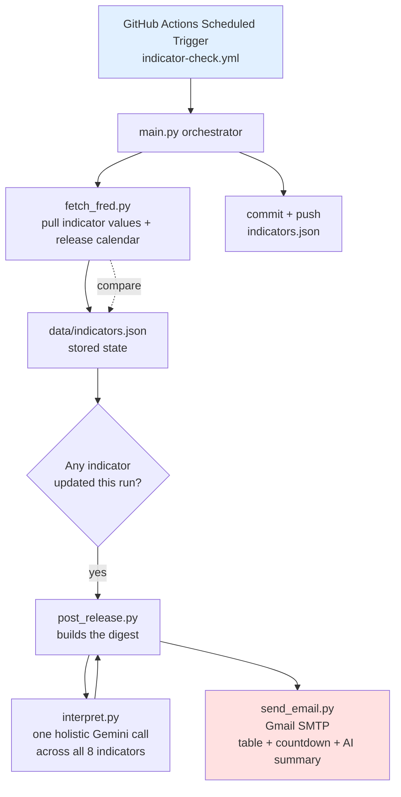

# V1 Technical Design — Macroeconomic Indicators Backend

**Companion to:** investment_dashboard_requirements.md, v1_user_stories.md
**Stack:** GitHub Actions (scheduler/compute) · commit-based JSON (storage) · Gmail SMTP (email) · FRED API (data) · Gemini API (AI interpretation, free tier)

**Product shape:** v1's single deliverable is one email — there is no webpage/dashboard. Stories 4, 5, and 6 (AI interpretation, indicator table, next-release preview) are three pieces of *content* that all land in that one email, not three separate features with their own delivery mechanism.

---

## 1. Architecture Overview



**Why this shape:** a single scheduled workflow run does everything — fetch, compare, build the digest, email, commit — so there's one code path to reason about and no separate always-on server or hosted page to maintain. The whole product surface is the inbox.

## 2. Repository Structure

```
/
├── .github/workflows/
│   └── indicator-check.yml
├── data/
│   └── indicators.json          # persistent store (Story 2)
├── src/
│   ├── main.py                  # orchestrator — ingestion loop (Story 1)
│   ├── fetch_fred.py            # FRED API client
│   ├── indicators_config.py     # indicator → FRED series/category mapping
│   ├── storage.py               # load/save/query/trim indicators.json (Story 2)
│   ├── post_release.py          # Story 4/5/6 — builds the table + countdown +
│   │                             #   AI summary and sends the one digest email
│   ├── interpret.py             # Gemini API call for the holistic AI summary
│   ├── heuristics.py            # Sahm Rule / yield curve inversion streak
│   ├── backfill.py              # one-time history backfill (not part of main.py)
│   └── send_email.py            # Gmail SMTP wrapper
├── tests/
│   ├── test_fetch_fred.py
│   ├── test_ingestion.py
│   ├── test_release_calendar.py
│   ├── test_heuristics.py
│   ├── test_interpret.py
│   ├── test_post_release.py
│   ├── test_send_email.py
│   ├── test_backfill.py
│   └── test_storage.py
└── README.md
```

## 3. Data Schema — `data/indicators.json`

```json
{
  "last_digest_sent_at": "2026-09-04T14:00:00+00:00",
  "indicators": {
    "initial_jobless_claims": {
      "name": "Initial Jobless Claims",
      "category": "leading",
      "fred_series_id": "ICSA",
      "fred_release_id": "13",
      "history": [
        { "date": "2026-08-30", "value": 235000, "fetched_at": "2026-09-02T14:00:00Z" }
      ],
      "next_release_date": "2026-09-11"
    },
    "yield_curve_spread": {
      "name": "10yr-2yr Treasury Spread",
      "category": "leading",
      "fred_series_id": "T10Y2Y",
      "fred_release_id": null,
      "history": [],
      "next_release_date": null
    }
  }
}
```

Notes:
- `history` grows every run a genuinely new value is detected; never mutated retroactively
- "New" is decided by date, not equality: an incoming observation is only appended if its date is strictly newer than the last stored entry's date. A same-or-older date — a stale/cached FRED response, or a same-date revision — is ignored and logged as a warning rather than appended, so a transient bad response can never corrupt the chronological order or create a duplicate-date entry
- `history` is capped to a rolling 12-month window (`storage.trim_history`); entries older than 12 months before the current date are pruned on each append
- Daily-updated series like the yield curve spread have no fixed "release," so `fred_release_id`/`next_release_date` are null and Story 6's countdown simply skips them — only genuinely scheduled releases (jobs report, CPI, etc.) get a countdown
- `last_digest_sent_at` (top-level, alongside `indicators`) is the ISO timestamp of the last digest email actually sent — absent/null until the first digest ever fires. `post_release.indicators_updated_since` compares it against each indicator's latest `fetched_at` to decide what's new since the last email; `run_post_release` also uses it to enforce the weekly send interval (Section 5)

## 4. FRED Series Mapping (v1 indicators)

| Indicator | Category | FRED Series ID |
|---|---|---|
| Initial jobless claims | Leading | `ICSA` |
| Yield curve spread (10yr-2yr) | Leading | `T10Y2Y` |
| Building permits | Leading | `PERMIT` |
| Nonfarm payrolls | Coincident | `PAYEMS` |
| Industrial production | Coincident | `INDPRO` |
| Fed funds rate | Lagging | `FEDFUNDS` |
| CPI | Lagging | `CPIAUCSL` |
| Unemployment rate | Lagging | `UNRATE` |

Release calendar dates come from FRED's Releases API, keyed by `fred_release_id`, for series that map to a discrete release (jobs report, CPI, etc.) rather than continuously updated daily series.

## 5. Scheduling Design

- **Trigger:** GitHub Actions `schedule` (cron), running every 6 hours (`0 */6 * * *`)
- Ingestion and the release-calendar refresh run on *every* scheduled check, regardless of whether anything changed — for each indicator, fetch latest FRED value; if it's newer than the last stored `history` entry, append it. This keeps `data/indicators.json` fresh even though the email doesn't fire every time.
- **The digest email is throttled separately, to a weekly rollup** (`post_release.run_post_release`), gated on two conditions:
  1. At least one indicator has a `history` entry fetched *since the last digest was sent* (`last_digest_sent_at`, not just "this run" — several indicators update daily, e.g. the yield curve spread, and checking only "this run" would either spam on every 6-hour tick or silently drop updates that happened between emails)
  2. At least 7 days (`post_release.MIN_DIGEST_INTERVAL`) have passed since `last_digest_sent_at` — skipped otherwise, even if condition 1 is true, so an update doesn't trigger an email until the interval has elapsed
  - The very first digest ever (`last_digest_sent_at` unset) sends immediately once any indicator has data, without waiting a week
- 6-hour interval balances timeliness against GitHub Actions minute usage — for monthly-cadence indicators, checking 4x/day is more than sufficient and stays well within the free tier

## 6. The Digest Email (Stories 4, 5, 6) — Design

One email replaces what earlier drafts of this doc described as a per-indicator alert plus a separately-hosted dashboard page. `post_release.py` builds it whenever the weekly-rollup gate (Section 5) opens:

- **Story 5 content — the table:** all 8 indicators, grouped under Leading / Coincident / Lagging headers, each row showing indicator name, latest value, latest release date, and prior value. Backed directly by `data/indicators.json`'s `history` (Story 2) — built fresh at send time, so there's no separate "refresh" step the way a hosted page would need.
- **Story 6 content — the countdown:** for each indicator with a `next_release_date` (Story 3), days until that release; the single soonest upcoming release across all 8 is called out distinctly rather than left for the reader to find by scanning every row.
- **Story 4 content — the AI summary:** one holistic Gemini call reasoning across *all 8* indicators' recent history together — not one call per indicator. This is a deliberate change from an earlier per-indicator-alert design: a holistic read can connect indicators to each other (e.g. "unemployment ticked up while CPI cooled") in a way that N independent single-indicator summaries can't.

### AI Interpretation — Gemini API Call Design

Uses `gemini-3.8-flash` (the current free-tier Gemini model as of this
writing) via the `google-genai` SDK — chosen over a paid model since this
is a short, well-specified commentary task with low request volume, well
within the free tier's daily/per-minute limits. Structured output
(`response_schema` on a Pydantic model) enforces the `summary` /
`directional_read` shape rather than relying on prompt-only JSON
formatting. Transient failures (e.g. a `503` under high demand, observed
in real testing) are retried up to 3 times via the SDK's built-in
`HttpRetryOptions` before giving up.

**Input to the model, once per run (not once per indicator):**
- For every one of the 8 indicators: name, category, and a **historical window** of its last 12 stored readings (not just the single prior value) — enough to distinguish a real multi-month trend from a one-off noisy blip
- Which indicator(s) are newly updated this run, so the model knows what triggered the email
- For indicators with a well-known named heuristic, that heuristic's current computed state, passed in as data rather than left for the model to infer:
  - **Unemployment rate** → Sahm Rule value (3-month average unemployment rate minus its low point over the prior 12 months; a reading ≥0.5 is a widely-used recession signal)
  - **Yield curve spread** → whether it's currently inverted (negative) and, if so, how many consecutive readings it's been inverted

**Prompt instructs the model to:**
- Reason across all 8 indicators together, and across each one's historical window, not just the single most recent delta on the one(s) that changed
- Explain in plain English what changed and why it matters for a long-term buy-and-hold investor, considering how indicators relate to each other where relevant
- Give **one overall** directional read: bullish / bearish / neutral, with one sentence of reasoning
- Keep total output short enough for an email body (a few sentences)

**Deliberately excluded from the input:** the AI's own past interpretations. Feeding prior AI commentary back in risks anchoring the model to its earlier read rather than reasoning fresh from the data, and compounds any past misread. Continuity across emails (e.g. "claims have now risen for 3 straight readings") comes from the historical window of raw values, not from re-showing old commentary.

**Output handling:**
- Parsed and inserted into the digest email template, above the table
- If the API call fails after retries, `post_release.py` catches the error and sends the digest anyway with just the table + countdown (no AI section) — satisfies Story 4's graceful-degradation criterion
- Email always includes a fixed disclaimer line whenever the AI section is present: *"This is automated commentary based on indicator trends, not personalized financial advice."*

## 7. Email Design

One email per triggering run. Subject line names what changed:

- `[Indicator Digest] 2 updates: CPI, Unemployment Rate`

Body, top to bottom: the holistic AI summary + directional read + disclaimer (Story 4, omitted on AI failure) → the full indicator table grouped by category (Story 5) → the next-release countdown, soonest release called out (Story 6).

Sent via `send_email.py`, a thin wrapper around Python's `smtplib` using Gmail SMTP (`smtp.gmail.com:587`) with an app password.

## 8. Secrets & Configuration

Stored as GitHub Actions repository secrets (never committed to the repo):

| Secret | Purpose |
|---|---|
| `FRED_API_KEY` | Authenticates FRED API requests |
| `GMAIL_ADDRESS` | Sender/account for SMTP |
| `GMAIL_APP_PASSWORD` | Gmail app password (not your login password) |
| `RECIPIENT_EMAIL` | Where alerts get sent (your inbox) |
| `GEMINI_API_KEY` | Gemini API access for interpretation |

## 9. Error Handling & Idempotency Summary

- Per-indicator try/catch in `fetch_fred.py` — one bad fetch logs and continues, doesn't halt the run (Story 1)
- Date-recency check (not equality) in `main.run_ingestion` prevents duplicate digest emails on repeated runs within the same cycle, and also rejects a same-or-older-dated observation (stale/cached API response, same-date revision) instead of appending it out of order (Story 1, Story 2)
- `storage.trim_history` prunes entries older than a rolling 12-month window on every append, keeping `indicators.json` from growing unbounded (Story 2)
- AI interpretation failure degrades gracefully to a table-and-countdown-only digest (Story 4)
- All errors logged to the GitHub Actions run log (visible in the Actions tab) for debugging — no separate logging service needed at this scale

## 10. One-Time Setup Checklist (before first run)
- [ ] Create free FRED API key
- [ ] Create a free Gemini API key
- [ ] Generate a Gmail app password
- [ ] Create the GitHub repo, add the secrets above
- [ ] Confirm the workflow's default `GITHUB_TOKEN` has write permission to push commits (repo Settings → Actions → Workflow permissions)
