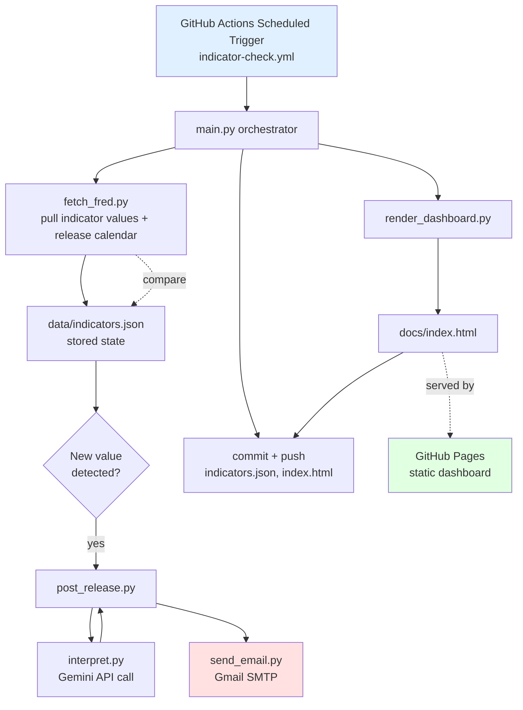

# V1 Technical Design — Macroeconomic Indicators Backend

**Companion to:** investment_dashboard_requirements.md, v1_user_stories.md
**Stack:** GitHub Actions (scheduler/compute) · commit-based JSON (storage) · Gmail SMTP (email) · FRED API (data) · Gemini API (AI interpretation, free tier) · GitHub Pages (static dashboard)

---

## 1. Architecture Overview



**Why this shape:** a single scheduled workflow run does everything — fetch, compare, alert, render, commit — so there's one code path to reason about and no separate always-on server. GitHub Pages serves the dashboard as a static file that the same workflow regenerates each run, so there's no separate hosting to manage for Story 5/6's table view.

## 2. Repository Structure

```
/
├── .github/workflows/
│   └── indicator-check.yml
├── data/
│   └── indicators.json          # persistent store (Story 2)
├── docs/
│   └── index.html               # generated dashboard (Story 5/6), served via GitHub Pages
├── src/
│   ├── main.py                  # orchestrator — ingestion loop (Story 1)
│   ├── fetch_fred.py            # FRED API client
│   ├── indicators_config.py     # indicator → FRED series/category mapping
│   ├── storage.py               # load/save/query/trim indicators.json (Story 2)
│   ├── post_release.py          # Story 4 logic
│   ├── interpret.py             # Gemini API call for AI summary/read
│   ├── send_email.py            # Gmail SMTP wrapper
│   └── render_dashboard.py      # Story 5/6 — builds docs/index.html
├── tests/
│   ├── test_fetch_fred.py
│   ├── test_ingestion.py
│   └── test_storage.py
└── README.md
```

## 3. Data Schema — `data/indicators.json`

```json
{
  "indicators": {
    "initial_jobless_claims": {
      "name": "Initial Jobless Claims",
      "category": "leading",
      "fred_series_id": "ICSA",
      "fred_release_id": "13",
      "history": [
        { "date": "2026-08-30", "value": 235000, "fetched_at": "2026-09-02T14:00:00Z" }
      ],
      "next_release_date": "2026-09-11"
    },
    "yield_curve_spread": {
      "name": "10yr-2yr Treasury Spread",
      "category": "leading",
      "fred_series_id": "T10Y2Y",
      "fred_release_id": null,
      "history": [],
      "next_release_date": null
    }
  }
}
```

Notes:
- `history` grows every run a genuinely new value is detected; never mutated retroactively
- "New" is decided by date, not equality: an incoming observation is only appended if its date is strictly newer than the last stored entry's date. A same-or-older date — a stale/cached FRED response, or a same-date revision — is ignored and logged as a warning rather than appended, so a transient bad response can never corrupt the chronological order or create a duplicate-date entry
- `history` is capped to a rolling 12-month window (`storage.trim_history`); entries older than 12 months before the current date are pruned on each append
- Daily-updated series like the yield curve spread have no fixed "release," so `fred_release_id`/`next_release_date` are null and Story 6's countdown simply skips them — only genuinely scheduled releases (jobs report, CPI, etc.) get a countdown

## 4. FRED Series Mapping (v1 indicators)

| Indicator | Category | FRED Series ID |
|---|---|---|
| Initial jobless claims | Leading | `ICSA` |
| Yield curve spread (10yr-2yr) | Leading | `T10Y2Y` |
| Building permits | Leading | `PERMIT` |
| Nonfarm payrolls | Coincident | `PAYEMS` |
| Industrial production | Coincident | `INDPRO` |
| Fed funds rate | Lagging | `FEDFUNDS` |
| CPI | Lagging | `CPIAUCSL` |
| Unemployment rate | Lagging | `UNRATE` |

Release calendar dates come from FRED's Releases API, keyed by `fred_release_id`, for series that map to a discrete release (jobs report, CPI, etc.) rather than continuously updated daily series.

## 5. Scheduling Design

- **Trigger:** GitHub Actions `schedule` (cron), running every 6 hours (`0 */6 * * *`)
- Every run performs the same check regardless of what's changed:
  - **Post-release check** — for each indicator, fetch latest FRED value; if it's newer than the last stored `history` entry → send post-release email (with AI interpretation) and append to `history`
- Every run also regenerates `docs/index.html` regardless of whether anything changed, so the dashboard always reflects the latest commit, including the next-release countdown (Story 6) pulled from the release calendar
- 6-hour interval balances timeliness against GitHub Actions minute usage — for monthly-cadence indicators, checking 4x/day is more than sufficient and stays well within the free tier

## 6. AI Interpretation (Story 4) — Gemini API Call Design

Uses `gemini-3.8-flash` (the current free-tier Gemini model as of this
writing) via the `google-genai` SDK — chosen over a paid model since this
is a short, well-specified commentary task with low request volume, well
within the free tier's daily/per-minute limits. Structured output
(`response_schema` on a Pydantic model) enforces the `summary` /
`directional_read` shape rather than relying on prompt-only JSON
formatting.

**Input to the model per triggered indicator:**
- Indicator name, category, description of what it measures
- New value and its date
- A **historical window** of the last 12 stored readings (not just the single prior value) — enough to distinguish a real multi-month trend from a one-off noisy blip, which a bare before/after comparison can't do
- For indicators with a well-known named heuristic, that heuristic's current computed state, passed in as data rather than left for the model to infer:
  - **Unemployment rate** → Sahm Rule value (3-month average unemployment rate minus its low point over the prior 12 months; a reading ≥0.5 is a widely-used recession signal)
  - **Yield curve spread** → whether it's currently inverted (negative) and, if so, how many consecutive readings it's been inverted

**Prompt instructs the model to:**
- Reason from the historical window and any computed heuristic value, not just the single most recent delta
- Explain in plain English what changed and why it matters for a long-term buy-and-hold investor
- Give a directional read: bullish / bearish / neutral, with one sentence of reasoning
- Keep total output short enough for an email body (a few sentences)

**Deliberately excluded from the input:** the AI's own past interpretations. Feeding prior AI commentary back in risks anchoring the model to its earlier read rather than reasoning fresh from the data, and compounds any past misread. Continuity across emails (e.g. "claims have now risen for 3 straight readings") comes from the historical window of raw values, not from re-showing old commentary.

**Output handling:**
- Parsed and inserted into the post-release email template
- If the API call fails or times out, `post_release.py` catches the error and sends the email with just the raw data (name/value/change), skipping the AI section — satisfies Story 4's graceful-degradation criterion
- Email always includes a fixed disclaimer line: *"This is automated commentary based on indicator trends, not personalized financial advice."*

## 7. Email Design

Subject line follows a consistent convention so alerts are easy to spot in your inbox:

- `[Indicator Update] Nonfarm Payrolls: 180K (+15K)`

Sent via `send_email.py`, a thin wrapper around Python's `smtplib` using Gmail SMTP (`smtp.gmail.com:587`) with an app password.

## 8. Dashboard Rendering (Story 5/6)

- `render_dashboard.py` reads `data/indicators.json` and generates a single static `docs/index.html`
- Grouped sections: Leading / Coincident / Lagging, each listing: indicator name, latest value, latest release date, prior value, and — where applicable — "next release in N days"
- No JavaScript framework needed for v1; plain HTML/CSS keeps it simple to generate from Python and free to host on GitHub Pages
- No authentication — GitHub Pages URL is unlisted but technically public; acceptable for non-sensitive macro data (this is public FRED data, not personal financial info)

## 9. Secrets & Configuration

Stored as GitHub Actions repository secrets (never committed to the repo):

| Secret | Purpose |
|---|---|
| `FRED_API_KEY` | Authenticates FRED API requests |
| `GMAIL_ADDRESS` | Sender/account for SMTP |
| `GMAIL_APP_PASSWORD` | Gmail app password (not your login password) |
| `RECIPIENT_EMAIL` | Where alerts get sent (your inbox) |
| `GEMINI_API_KEY` | Gemini API access for interpretation |

## 10. Error Handling & Idempotency Summary

- Per-indicator try/catch in `fetch_fred.py` — one bad fetch logs and continues, doesn't halt the run (Story 1)
- Date-recency check (not equality) in `main.run_ingestion` prevents duplicate post-release emails on repeated runs within the same cycle, and also rejects a same-or-older-dated observation (stale/cached API response, same-date revision) instead of appending it out of order (Story 1, Story 2)
- `storage.trim_history` prunes entries older than a rolling 12-month window on every append, keeping `indicators.json` from growing unbounded (Story 2)
- AI interpretation failure degrades gracefully to raw-data-only email (Story 4)
- All errors logged to the GitHub Actions run log (visible in the Actions tab) for debugging — no separate logging service needed at this scale

## 11. One-Time Setup Checklist (before first run)
- [ ] Create free FRED API key
- [ ] Generate a Gmail app password
- [ ] Create the GitHub repo, add the 5 secrets above
- [ ] Enable GitHub Pages for the repo, pointed at `/docs`
- [ ] Confirm the workflow's default `GITHUB_TOKEN` has write permission to push commits (repo Settings → Actions → Workflow permissions)
